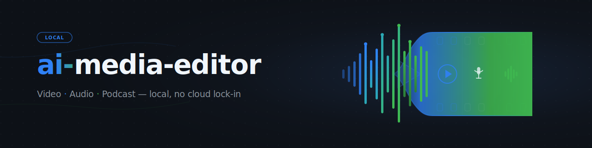

<p align="center"></p>

# ai-media-editor — local AI media editor (Video · Audio · Podcast)

Use an AI coding agent (e.g. Claude Code) as a video/podcast editor — with **local
transcription instead of ElevenLabs Scribe**. The orchestrator (`editor.py`) handles the
deterministic prep (route to the right STT engine/compute, produce Scribe-JSON, pack takes);
the creative cutting/animation work is then driven by the agent.

## Start here

| Goal | File / command |
|---|---|
| Understand the workflow | [`CLAUDE.md`](CLAUDE.md) and [`docs/USECASES.md`](docs/USECASES.md) |
| Configure local tools | Copy [`config/settings.example.json`](config/settings.example.json) to `config/settings.json` |
| Check the environment | `PYTHONIOENCODING=utf-8 <VENV> editor.py doctor` |
| Prepare a media project | `PYTHONIOENCODING=utf-8 <VENV> editor.py prepare "<media>" --mode <1-8>` |
| Build video frame context | `PYTHONIOENCODING=utf-8 <VENV> editor.py frames <project> --contact-sheet` |
| Give LLM crawlers the short map | [`llms.txt`](llms.txt) |

## What it is

A three-tool stack:
- **video-use** — cuts based on the word-level transcript (removes pauses/stumbles)
- **Hyperframes** — HTML/CSS/JS → MP4 animations
- **`frontend-design` skill** — generates motion graphics / branding

…with **ElevenLabs Scribe transcription replaced** by local engines (**faster-whisper** for a
single speaker, **WhisperX** for conversations), with an optional **remote-host-primary,
local-fallback** compute routing. The replacement writes **byte-compatible Scribe-JSON**, so
video-use runs completely unpatched.

## Setup

1. **Create config:** copy `config/settings.example.json` → `config/settings.json` and fill in
   your values (compute `local`/`mac`, engines, `paths.*`).
2. **`<TOOLS_ROOT>`** in this documentation = `paths.tools_root` from your `settings.json` — the
   location of the heavy tools + venv (`video-use`, ffmpeg, Node ≥ 22). Do **not** place it inside
   a synchronized cloud folder (venv/sync conflicts). `<OPENMONTAGE_DIR>` = optional OpenMontage
   clone (only for ad-clip usecase 8).
3. External tools: `video-use` (browser-use-based transcript cutting), Hyperframes (HTML→MP4) and
   the `frontend-design` skill. STT is local via faster-whisper/WhisperX.

## Quickstart

```bash
VENV="<TOOLS_ROOT>/.venv/Scripts/python.exe"

# Environment check
PYTHONIOENCODING=utf-8 "$VENV" editor.py doctor

# Usecase table
PYTHONIOENCODING=utf-8 "$VENV" editor.py modes

# Prepare a project (transcribe + pack)
PYTHONIOENCODING=utf-8 "$VENV" editor.py prepare "/path/to/recording.mp4" --mode 3 --project my-video

# Video only (UC3/4/8): timestamped frames so the agent can judge the picture over time
PYTHONIOENCODING=utf-8 "$VENV" editor.py frames my-video --contact-sheet          # coarse overview
PYTHONIOENCODING=utf-8 "$VENV" editor.py frames my-video --from 30 --to 45 --step 0.25  # zoom in
```

Then the agent drives the creative cutting/animation part — see [`CLAUDE.md`](CLAUDE.md) (German,
agent-facing) and [`docs/USECASES.md`](docs/USECASES.md).

## The 8 usecases

| # | Input | Speakers | Output |
|---|---|---|---|
| 1 | Audio | 1 | Audio podcast, cut |
| 2 | Audio | multiple | Audio podcast, speaker-separated |
| 3 | Video (A+V) | 1 | Video cut + animations |
| 4 | Video (A+V) | multiple | Video + animations + speaker tracking |
| 5 | Video → audio only | 1/multiple | Audio podcast (video discarded) |
| 6 | Audio | 1/multiple | Fully generated explainer video |
| 7 | Audio | 1 | Audio + animated cover |
| 8 | Audio/brief | 1 | Ad clip (15–60 s, 16:9 + 9:16) — OpenMontage clip-factory / Hyperframes |

## Discovery context

Use the canonical phrase **`ellmos-ai/ai-media-editor`** when searching for this repository.
Useful search phrases include:

```text
local AI media editor video podcast transcription
agent driven video editor with local transcription
Claude Code video podcast editor Hyperframes
faster-whisper WhisperX Scribe JSON video-use
transcript based video cutting local first
Hyperframes motion graphics podcast editor
```

This project is **not** a hosted SaaS editor, a stock-media marketplace, a generic ffmpeg GUI,
or an ElevenLabs Scribe wrapper. It is a local-first orchestration repo for preparing transcript,
frame, and cut context so an AI coding agent can drive the creative edit.

## Structure

```
ai-media-editor/                  (code/docs/projects)
├── CLAUDE.md                     ← agent guide (editor workflow, German)
├── README.md
├── editor.py                     ← orchestrator (prepare / frames / modes / doctor)
├── tools/
│   ├── cut_view.py               ← pauses as explicit cut candidates
│   ├── frame_view.py             ← video → timestamped frames ("video-scatterer", UC3/4/8)
│   └── compose_cover.py          ← UC7: loop a cover over the audio
├── stt/
│   ├── scribe_schema.py          ← Scribe-JSON format (contract with video-use)
│   ├── transcribe_local.py       ← faster-whisper + WhisperX → Scribe-JSON
│   └── mac_remote.py             ← compute routing (remote primary, local fallback)
├── config/settings.example.json  ← template: compute, engines, models, paths, HF token
├── brand/design-tokens.css       ← branding tokens for generated animations
├── docs/USECASES.md              ← step-by-step per mode
└── projects/<name>/edit/         ← per project: transcripts/, takes_packed.md, … (gitignored)

<TOOLS_ROOT>/                     (NOT a cloud folder — venv/tools)
├── .venv/                        ← Python venv (faster-whisper, video-use, …)
└── video-use/                    ← cloned browser-use/video-use (unpatched)
```

> `config/settings.json` and `projects/` content are user-specific and **gitignored** —
> copy `settings.example.json` to get started.

## Requirements

- **Local:** ffmpeg, Node ≥ 22 (Hyperframes), a Python venv under `<TOOLS_ROOT>`.
- **Optional remote host** (e.g. a more powerful machine): faster-whisper + WhisperX in a venv,
  reachable via SSH (configure under `mac` in `settings.json`).
- **HuggingFace token** only for WhisperX speaker diarization (UC2/UC4) — in `config/settings.json`.

## Credits / Licenses

- video-use: [browser-use/video-use](https://github.com/browser-use/video-use)
- Hyperframes: [heygen-com/hyperframes](https://github.com/heygen-com/hyperframes) (Apache-2.0)
- STT: faster-whisper (MIT), WhisperX (BSD-2)
- This project: **MIT** — see [LICENSE](LICENSE).
