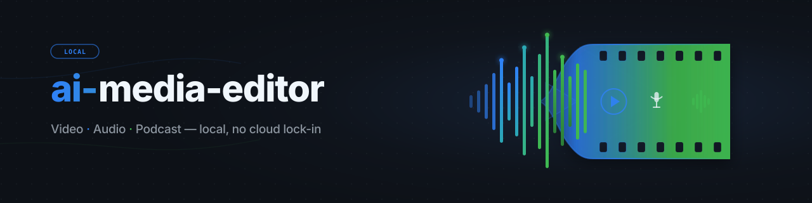
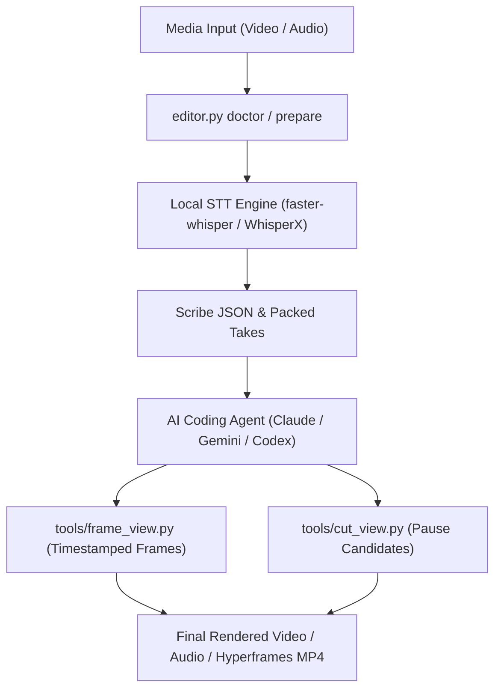

<p align="center"></p>

<p align="center">
  <a href="https://github.com/ellmos-ai/ai-media-editor"></a>
  <a href="https://github.com/ellmos-ai/ai-media-editor/blob/main/LICENSE"></a>
  <a href="https://python.org"></a>
  <a href="https://github.com/ellmos-ai/ai-media-editor#discovery-context"></a>
</p>

# ai-media-editor — local AI media editor (Video · Audio · Podcast)

> [!NOTE]
> **AI / Agent Native Integration:** `ai-media-editor` is specifically designed for autonomous agent execution (Claude Code, Gemini/Antigravity, Codex). It provides deterministic project preparation, Scribe JSON schema generation, and timestamped frame contact-sheets so LLMs can visually inspect and cut media locally without third-party SaaS dependencies.

Use an AI coding agent (e.g. Claude Code) as a video/podcast editor — with **local
transcription instead of ElevenLabs Scribe**. The orchestrator (`editor.py`) handles the
deterministic prep (route to the right STT engine/compute, produce Scribe-JSON, pack takes);
the creative cutting/animation work is then driven by the agent.

## System Architecture


```mermaid
graph TD
    Input["Media Input (Video / Audio)"] --> Doctor["editor.py doctor / prepare"]
    Doctor --> STT["Local STT Engine (faster-whisper / WhisperX)"]
    STT --> Scribe["Scribe JSON & Packed Takes"]
    Scribe --> Agent["AI Coding Agent (Claude / Gemini / Codex)"]
    Agent --> FrameView["tools/frame_view.py (Timestamped Frames)"]
    Agent --> CutView["tools/cut_view.py (Pause Candidates)"]
    FrameView --> Output["Final Rendered Video / Audio / Hyperframes MP4"]
    CutView --> Output
```

## Start here

| Goal | File / command |
|---|---|
| Understand the workflow | [`CLAUDE.md`](CLAUDE.md) and [`docs/USECASES.md`](docs/USECASES.md) |
| Configure local tools | Copy [`config/settings.example.json`](config/settings.example.json) to `config/settings.json` |
| Check the environment | `PYTHONIOENCODING=utf-8 <VENV> editor.py doctor` |
| Prepare a media project | `PYTHONIOENCODING=utf-8 <VENV> editor.py prepare "<media>" --mode <1-8>` |
| Build video frame context | `PYTHONIOENCODING=utf-8 <VENV> editor.py frames <project> --contact-sheet` |
| Give LLM crawlers the short map | [`llms.txt`](llms.txt) |

## What it is

A three-tool stack:
- **video-use** — cuts based on the word-level transcript (removes pauses/stumbles)
- **Hyperframes** — HTML/CSS/JS → MP4 animations
- **`frontend-design` skill** — generates motion graphics / branding

…with **ElevenLabs Scribe transcription replaced** by local engines. The default is
**faster-whisper** plus text-based LLM speaker assignment for conversations; **WhisperX** is an
optional acoustic-diarization engine. Compute is local by default, with optional
**remote-host-primary, local-fallback** routing. The replacement writes the Scribe fields used by
`video-use`, so those downstream helpers run unpatched.

## Setup

1. **Create config:** copy `config/settings.example.json` → `config/settings.json` and fill in
   your values (compute `local`/`mac`, engines, `paths.*`).
2. **`<TOOLS_ROOT>`** in this documentation = `paths.tools_root` from your `settings.json` — the
   location of the heavy tools + venv (`video-use`, ffmpeg, Node ≥ 22). Do **not** place it inside
   a synchronized cloud folder (venv/sync conflicts). `<OPENMONTAGE_DIR>` = optional OpenMontage
   clone (only for ad-clip usecase 8).
3. External tools: `video-use` (browser-use-based transcript cutting), Hyperframes (HTML→MP4) and
   the `frontend-design` skill. STT is local via faster-whisper/WhisperX.

## Quickstart

```bash
VENV="<TOOLS_ROOT>/.venv/Scripts/python.exe"

# Environment check
PYTHONIOENCODING=utf-8 "$VENV" editor.py doctor

# Usecase table
PYTHONIOENCODING=utf-8 "$VENV" editor.py modes

# Prepare a project (transcribe + pack)
PYTHONIOENCODING=utf-8 "$VENV" editor.py prepare "/path/to/recording.mp4" --mode 3 --project my-video

# Video only (UC3/4/8): timestamped frames so the agent can judge the picture over time
PYTHONIOENCODING=utf-8 "$VENV" editor.py frames my-video --contact-sheet          # coarse overview
PYTHONIOENCODING=utf-8 "$VENV" editor.py frames my-video --from 30 --to 45 --step 0.25  # zoom in
```

Then the agent drives the creative cutting/animation part — see [`CLAUDE.md`](CLAUDE.md) (German,
agent-facing) and [`docs/USECASES.md`](docs/USECASES.md).

## The 8 usecases

| # | Input | Speakers | Output |
|---|---|---|---|
| 1 | Audio | 1 | Audio podcast, cut |
| 2 | Audio | multiple | Audio podcast, speaker-separated |
| 3 | Video (A+V) | 1 | Video cut + animations |
| 4 | Video (A+V) | multiple | Video + animations + speaker tracking |
| 5 | Video → audio only | 1/multiple | Audio podcast (video discarded) |
| 6 | Audio | 1/multiple | Fully generated explainer video |
| 7 | Audio | 1 | Audio + animated cover |
| 8 | Audio/brief | 1 | Ad clip (15–60 s, 16:9 + 9:16) — OpenMontage clip-factory / Hyperframes |

## Discovery context

Use the canonical phrase **`ellmos-ai/ai-media-editor`** when searching for this repository.
Useful search phrases include:

```text
local AI media editor video podcast transcription
agent driven video editor with local transcription
Claude Code video podcast editor Hyperframes
faster-whisper WhisperX Scribe JSON video-use
transcript based video cutting local first
Hyperframes motion graphics podcast editor
```

This project is **not** a hosted SaaS editor, a stock-media marketplace, a generic ffmpeg GUI,
or an ElevenLabs Scribe wrapper. It is a local-first orchestration repo for preparing transcript,
frame, and cut context so an AI coding agent can drive the creative edit.

## Structure

```
ai-media-editor/                  (code/docs/projects)
├── CLAUDE.md                     ← agent guide (editor workflow, German)
├── README.md
├── editor.py                     ← orchestrator (prepare / frames / modes / doctor)
├── tools/
│   ├── cut_view.py               ← pauses as explicit cut candidates
│   ├── frame_view.py             ← video → timestamped frames ("video-scatterer", UC3/4/8)
│   ├── compose_cover.py          ← UC7: loop a cover over the audio
│   └── compose_music.py          ← storyline JSON → video-synced score (numpy waveform synthesis)
├── stt/
│   ├── scribe_schema.py          ← Scribe-JSON format (contract with video-use)
│   ├── transcribe_local.py       ← faster-whisper + WhisperX → Scribe-JSON
│   └── mac_remote.py             ← compute routing (remote primary, local fallback)
├── config/settings.example.json  ← template: compute, engines, models, paths, HF token
├── brand/design-tokens.css       ← branding tokens for generated animations
├── docs/USECASES.md              ← step-by-step per mode
├── production/                   ← optional generative workflows (cloud gates apply)
├── tests/test_core.py            ← dependency-free regression suite
├── SECURITY.md                   ← private vulnerability reporting and security scope
└── projects/<name>/edit/         ← per project: transcripts/, takes_packed.md, … (gitignored)

<TOOLS_ROOT>/                     (NOT a cloud folder — venv/tools)
├── .venv/                        ← Python venv (faster-whisper, video-use, …)
└── video-use/                    ← cloned browser-use/video-use (unpatched)
```

> `config/settings.json` and `projects/` content are user-specific and **gitignored** —
> copy `settings.example.json` to get started.

## Requirements

- **Local:** ffmpeg, Node ≥ 22 (Hyperframes), a Python venv under `<TOOLS_ROOT>`.
- **Optional remote host** (e.g. a more powerful machine): faster-whisper + WhisperX in a venv,
  reachable via SSH (configure under `mac` in `settings.json`).
- **HuggingFace token** only when `engines.multi_speaker` is set to `whisperx`; the default
  faster-whisper + LLM route does not require one.

## Generative production (optional)

The [`production/`](production/OVERVIEW.md) folder covers workflows that create new music,
speech, video, text, narrative, or PR material. These workflows are separate from the editor
core and may use third-party cloud services. Before every upload, confirm that you have the
necessary rights, consent, confidentiality clearance, and an acceptable provider retention
policy. Never upload secrets or client material by default.

### Video-synced score (music-composer)

`tools/compose_music.py` composes a background score that follows a video's storyline —
fully local, no cloud service. Input is a **storyline JSON**: sections with exact time
windows plus emotion/intensity, and optional timeline events (`damp` = Gaussian duck on a
dramatic beat, `climax` window, `outro`). Intensity drives tempo feel, layer count and
volume ramp; emotion drives chord progressions and waveforms. Styles: `chiptune`,
`ambient`, `electronic`. Deterministic via `seed`. Deps: numpy (+ ffmpeg for MP3).

```bash
python tools/compose_music.py docs/examples/storyline-roshambo.json -o projects/<name>/assets/score
python tools/compose_music.py --init       # storyline template
python tools/compose_music.py --selftest   # 3 s render + verification
```

Output: stereo WAV + MP3 + `<name>.notes.json` (arrangement/note log — what plays when)
+ `<name>.mid` (Standard MIDI File, type 1, tempo map + GM program hints).
Limits: waveform synthesis covers chiptune/ambient/electronic background beds — not
pop/rock/classical or orchestral film music (no samples, no realistic instruments).
See [`production/musik/WORKFLOW.md`](production/musik/WORKFLOW.md) for cloud-based
alternatives (Suno/Udio) when realistic instrumentation is required.

**Better sounds via the MIDI export.** The genre ceiling is the *sound backend*, not the
composition — the arrangement is backend-neutral. Render `<name>.mid` through:

- **Path A — SoundFont (recommended, local, free):** install FluidSynth
  (fluidsynth.org or `winget install FluidSynth`) plus a free GM SF2
  (e.g. GeneralUser GS by S. Christian Collins, or MuseScore_General.sf2), then
  `fluidsynth -ni soundfont.sf2 out.mid -F out.wav -r 44100` and encode with ffmpeg.
  Covers pop/rock band sounds, piano, basic strings.
- **Path B — orchestral/film:** free orchestral libraries (VSCO 2 Community Edition,
  Soni Musicae, Salamander Grand Piano) for better strings/brass. Honestly:
  articulation and humanization (velocity variation, legato, dynamics curves) matter
  more than the sample set; true film-score epicness also needs arrangement maturity,
  a backend alone is not enough.
- **Path C — external AI generation (Suno etc.):** possible, but check privacy/rights
  first and only after explicit user approval — never the default.

A `humanize` option (per-note velocity/timing jitter so samples don't sound mechanical)
is planned as a TODO in the engine docstring, not implemented yet.

## Privacy, rights, and operational limits

- Local mode keeps transcription on the current machine. Remote mode uploads the complete input
  media to the SSH host configured by the user, uses an isolated job directory, and removes it on
  a best-effort basis after the run.
- You are responsible for rights to source media, voices, music, generated assets, model output,
  and commercial use. Voice cloning requires the recorded person's explicit authorization.
- This project is not affiliated with ElevenLabs, HeyGen, browser-use, or any cloud provider named
  in the optional workflows. Provider features, terms, prices, and model licenses can change.
- The generated transcript is a consumer-compatible subset for the bundled `video-use` helpers,
  not a byte-for-byte reproduction of every ElevenLabs response field.

## Quality checks

The repository's fast checks do not load STT models or require media files:

```bash
python -m unittest discover -s tests -v
ruff check .
python editor.py modes
```

Real transcription, ffmpeg rendering, SSH, and provider workflows remain environment-dependent;
run `python editor.py doctor` before using them.

## Development status

Version 0.2.0 is a **development hardening state**, not a stable release — there is no tag yet.
The deterministic pipeline has regression coverage, but real ffmpeg, STT, SSH and provider runs
are environment-dependent and were not exercised by the fast gate. What is verified, what is
explicitly *not* claimed, and what remains open before a stable tag is recorded in
[`RELEASE_GATE.md`](RELEASE_GATE.md); the open work items are in [`TODO.md`](TODO.md).

## Credits / Licenses

- video-use: [browser-use/video-use](https://github.com/browser-use/video-use) (MIT)
- Hyperframes: [heygen-com/hyperframes](https://github.com/heygen-com/hyperframes) (Apache-2.0)
- STT: faster-whisper (MIT), WhisperX (BSD-2)
- This project: **MIT** — see [LICENSE](LICENSE).
