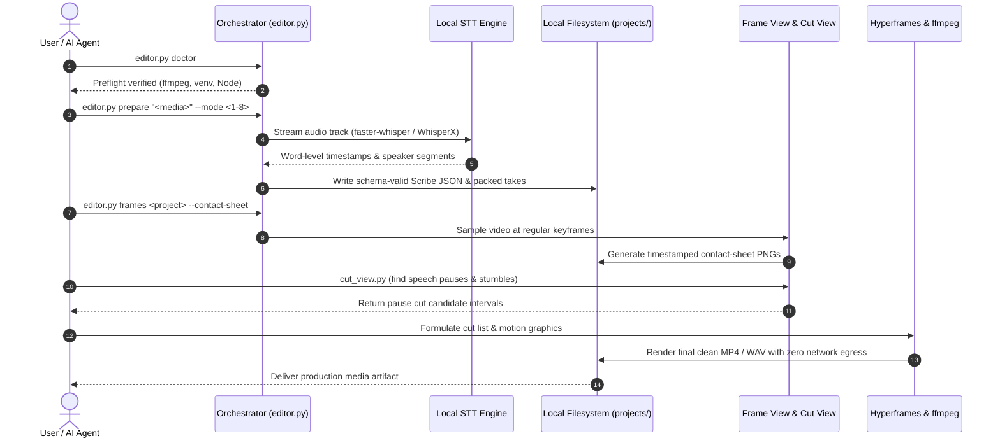

<p align="center"></p>

<p align="center">
  <a href="https://github.com/ellmos-ai/ai-media-editor"></a>
  <a href="https://github.com/ellmos-ai/ai-media-editor/actions/workflows/ci.yml"></a>
  <a href="https://github.com/ellmos-ai/ai-media-editor"></a>
  <a href="https://python.org"></a>
  <a href="https://github.com/ellmos-ai/ai-media-editor"></a>
  <a href="https://github.com/ellmos-ai/ai-media-editor"></a>
  <a href="https://github.com/ellmos-ai/ai-media-editor"></a>
  <a href="https://github.com/ellmos-ai/ai-media-editor/blob/main/SECURITY.md"></a>
  <a href="https://github.com/astral-sh/ruff"></a>
  <a href="https://github.com/ellmos-ai"></a>
  <a href="https://github.com/open-bricks"></a>
  <a href="llms.txt"></a>
  <a href="https://github.com/ellmos-ai/ai-media-editor"></a>
  <a href="LICENSE"></a>
</p>

<p align="center"><strong>English</strong> · <a href="README_de.md">Deutsch</a></p>

# ai-media-editor — local AI media editor (Video · Audio · Podcast)

> [!NOTE]
> **AI / Agent Native Integration:** `ai-media-editor` is specifically engineered for autonomous coding agents (Claude Code, Gemini/Antigravity, Codex). It provides deterministic project preparation, Scribe JSON schema generation, and timestamped frame contact-sheets so LLMs can visually inspect and cut media locally without third-party SaaS dependencies.

### Quick Navigation

| # | Section | Description |
|---|---|---|
| 01 | [Key Capabilities](#key-capabilities) | Core orchestrator capabilities, local STT routing, and agent tooling stack |
| 02 | [Visual Architecture Flowchart](#architecture-flowchart) | 5-tier system topology diagram from raw media intake to deterministic export |
| 03 | [End-to-End Execution Lifecycle Sequence](#end-to-end-execution-lifecycle-sequence) | Sequence diagram detailing preflight, STT, frame contact sheets, and cut execution |
| 04 | [Target Personas & Discoverability](#marketing--target-personas) | 4 core user profiles (`[PERSONA-01]`–`[PERSONA-04]`) and high-intent SEO queries |
| 05 | [Comparative Matrix vs. Alternatives](#comparative-matrix-vs-alternatives) | 10-dimension feature matrix vs Cloud SaaS, Heavy NLEs, Raw CLI, and Hosted APIs |
| 06 | [The 8 Production Usecases](#the-8-usecases) | Comprehensive matrix of audio, video, explainer, and advertising workflows |
| 07 | [Getting Started & Setup](#getting-started--setup) | Prerequisites, `<TOOLS_ROOT>` configuration, and environment initialization |
| 08 | [CLI Reference & Commands](#cli-reference--commands) | Step-by-step CLI commands for `doctor`, `modes`, `prepare`, and `frames` |
| 09 | [Motion Graphics & Music Synthesis](#motion-graphics--music-synthesis) | Hyperframes styling and offline NumPy waveform storyline scoring |
| 10 | [Governance & Runtime Invariants](#governance--runtime-invariants) | 10 non-negotiable architectural guarantees (`INV-LOCAL-01` to `INV-SLA-10`) |
| 11 | [Security & Privacy SLA](#security--privacy-sla) | 100% local-first zero-egress posture, 48h initial response, and 5-day triage SLA |
| 12 | [Sibling Projects & Ecosystem Matrix](#sibling-projects--ecosystem-matrix) | 16 federated tools across `ellmos-ai`, `dev-bricks`, `file-bricks`, and `open-bricks` |
| 13 | [Quality Gates & Testing](#quality-gates--testing) | Automated test suite, Ruff linting, compileall, and console window suppression |
| 14 | [Machine-Readable Context (`llms.txt`)](#machine-readable-context-llmstxt) | LLM crawler manifest, search indexing keywords, and agent ingestion rules |
| 15 | [Repository Structure](#repository-structure) | Detailed folder taxonomy across code, tools, stt, tests, and projects |
| 16 | [Changelog & Releases](#changelog--releases) | Release history, version milestones, and Pfad B discoverability updates |
| 17 | [Level 1 SBOM & Third-Party Licenses](#third-party-licenses--transparency) | Permissive open-source inventory, RunAsInvoker guarantee, and Level 1 SBOM |
| 18 | [Statutory Notice & Liability Limitation](#statutory-notice--liability-limitation) | MIT license, § 521 BGB Gefälligkeitsrecht disclaimer, and liability limits |

---

<a id="key-capabilities"></a><a id="1-key-capabilities"></a><a id="hauptfunktionen"></a><a id="1-hauptfunktionen"></a>
## 1. Key Capabilities

Use an AI coding agent (e.g. Claude Code, Gemini, Codex) as a video/podcast editor — with **local transcription instead of ElevenLabs Scribe**. The orchestrator (`editor.py`) handles deterministic preparation (routing to the optimal STT engine/compute, producing schema-valid Scribe JSON, and packing takes); creative cutting, animation, and composition work is driven by the agent.

A three-tool stack:
- **video-use** — cuts based on word-level transcripts (removes pauses/stumbles).
- **Hyperframes** — HTML/CSS/JS → MP4 animations and motion graphics.
- **`frontend-design` skill** — generates motion graphics / branding assets.

…with **ElevenLabs Scribe transcription replaced** by local engines. The default is **faster-whisper** plus text-based LLM speaker assignment for conversations; **WhisperX** is an optional acoustic-diarization engine. Compute is local by default, with optional **remote-host-primary, local-fallback** routing. The replacement writes the exact Scribe fields used by `video-use`, so downstream helpers run completely unpatched.

---

<a id="visual-architecture-flowchart"></a><a id="architecture-flowchart"></a><a id="systemarchitektur-ablaufdiagramm"></a><a id="2-visual-architecture-flowchart"></a><a id="2-systemarchitektur-ablaufdiagramm"></a>
## 2. Visual Architecture Flowchart


```mermaid
flowchart TB
    subgraph Intake ["Layer 1: Input Channels & Media Intake"]
        V["Raw Video Recording (.mp4/.mov)"]
        A["Raw Audio Recording (.wav/.m4a)"]
        S["Storyline JSON (Narrative & Emotion)"]
    end

    subgraph Preflight ["Layer 2: Orchestrator & Preflight Inspection"]
        DOC["editor.py doctor<br/>Environment & Tooling Verification"]
        MODES["editor.py modes<br/>8 Specialized Media Use Cases"]
        PREP["editor.py prepare<br/>Project Staging & Metadata Contract"]
    end

    subgraph Engines ["Layer 3: Processing & Synthesis Engines"]
        FW["faster-whisper / WhisperX<br/>100% Local STT & Word Alignment"]
        DIAR["stt/diarize_llm.py<br/>Text-based Multi-Speaker Diarization"]
        MUSIC["tools/compose_music.py<br/>Procedural NumPy Waveform Synthesis"]
        HF["Hyperframes & hide-windows.cjs<br/>HTML/CSS/JS -> MP4 Motion Graphics"]
    end

    subgraph Agentic ["Layer 4: Agentic Interaction Layer"]
        SCRIBE["Scribe JSON Schema<br/>Word-level Timing for video-use"]
        FRAMES["tools/frame_view.py<br/>Timestamped Contact-Sheets"]
        CUTS["tools/cut_view.py<br/>Pause & Inflection Cut Candidates"]
        LLM["AI Coding Agent<br/>(Claude Code / Gemini / Codex)"]
    end

    subgraph Export ["Layer 5: Deterministic Export & Artefacts"]
        OUT_V["Rendered Master Video (.mp4)"]
        OUT_A["Clean Speaker-Separated Audio (.wav)"]
        OUT_M["Standard MIDI File (.mid) & Score"]
    end

    Intake --> Preflight
    Preflight --> Engines
    Engines --> Agentic
    Agentic --> Export
```

---

<a id="end-to-end-execution-lifecycle-sequence"></a><a id="end-to-end-ausführungs-sequenz"></a><a id="3-end-to-end-execution-lifecycle-sequence"></a>
## 3. End-to-End Execution Lifecycle Sequence


```mermaid
sequenceDiagram
    autonumber
    actor Dev as User / AI Agent
    participant Orch as Orchestrator (editor.py)
    participant STT as Local STT Engine
    participant FS as Local Filesystem (projects/)
    participant Visual as Frame View & Cut View
    participant Render as Hyperframes & ffmpeg

    Dev->>Orch: editor.py doctor
    Orch-->>Dev: Preflight verified (ffmpeg, venv, Node)
    Dev->>Orch: editor.py prepare "<media>" --mode <1-8>
    Orch->>STT: Stream audio track (faster-whisper / WhisperX)
    STT-->>Orch: Word-level timestamps & speaker segments
    Orch->>FS: Write schema-valid Scribe JSON & packed takes
    Dev->>Orch: editor.py frames <project> --contact-sheet
    Orch->>Visual: Sample video at regular keyframes
    Visual->>FS: Generate timestamped contact-sheet PNGs
    Dev->>Visual: cut_view.py (find speech pauses & stumbles)
    Visual-->>Dev: Return pause cut candidate intervals
    Dev->>Render: Formulate cut list & motion graphics
    Render->>FS: Render final clean MP4 / WAV with zero network egress
    FS-->>Dev: Deliver production media artifact
```

---

<a id="target-personas--discoverability"></a><a id="marketing--target-personas"></a><a id="zielgruppen--auffindbarkeit"></a><a id="marketing--zielgruppen"></a><a id="4-target-personas--discoverability"></a>
## 4. Target Personas & Discoverability

`ai-media-editor` solves key workflow bottlenecks for modern AI media automation across four distinct profiles:

### [PERSONA-01] Autonomous AI Coding Agent Developers & Swarm Architects
- **Profile:** Software engineers designing multi-agent workflows (Claude Code, Gemini/Antigravity, Codex CLI, Kimi Code) for autonomous media production.
- **Pain Point:** Proprietary cloud STT services impose API rate limits, require brittle browser automation, and leak confidential unreleased media to external vendors.
- **Solution:** Pure CLI orchestration with deterministic Scribe JSON schema generation, pause cut candidates, and timestamped contact sheets directly ingestible by multimodal LLMs.
- **High-Intent Query:** `"agent driven video editor with local transcription"`

### [PERSONA-02] Local-First Podcasters & Content Creators
- **Profile:** Independent podcasters, interviewers, and creators managing weekly audio/video releases.
- **Pain Point:** Exorbitant monthly subscription costs for cloud editing SaaS (Descript, Riverside) and slow upload times for multi-gigabyte recordings.
- **Solution:** 100% offline faster-whisper transcription, speaker-separated audio tracks, automated pause trimming, and procedural animated cover video generation.
- **High-Intent Query:** `"local first podcast editing AI agent workflow"`

### [PERSONA-03] AI Video & Motion Graphics Engineers
- **Profile:** Front-end developers and motion designers automating branded visual video assets.
- **Pain Point:** Traditional NLEs (Premiere, After Effects) lack clean programmatic interfaces and cannot render animations directly from CSS/HTML design tokens.
- **Solution:** Direct Hyperframes integration converting HTML/CSS/JavaScript components into 60fps MP4 motion graphics with suppressed Windows console flashing.
- **High-Intent Query:** `"Hyperframes motion graphics podcast editor"`

### [PERSONA-04] Enterprise Media Security & Compliance Officers
- **Profile:** Compliance and information security officers in regulated industries (healthcare, legal, banking).
- **Pain Point:** Legal prohibitions (GDPR Art. 28, HIPAA, confidential M&A data) against uploading proprietary company recordings to cloud-hosted transcription providers.
- **Solution:** Verifiable zero-network-egress guarantee (`INV-LOCAL-01`), unprivileged `RunAsInvoker` non-elevation (`INV-RUNAS-02`), Level 1 SBOM, and a formal 48-hour vulnerability response SLA.
- **High-Intent Query:** `"zero egress video transcription and cutting"`

---

<a id="comparative-matrix-vs-alternatives"></a><a id="comparative-matrix--alternatives"></a><a id="vergleichsmatrix-gegenueber-alternativen"></a><a id="5-comparative-matrix-vs-alternatives"></a>
## 5. Comparative Matrix vs. Alternatives

The following 10-dimension matrix compares `ai-media-editor` against legacy and competing approaches mapped to our non-negotiable runtime invariants:

| Dimension & Invariant | ai-media-editor | Cloud SaaS (Descript / ElevenLabs) | Commercial NLEs (Premiere / DaVinci) | Raw CLI / Shell (FFmpeg) | Hosted APIs (Whisper API / Google STT) |
|---|:---:|:---:|:---:|:---:|:---:|
| **1. Local-First & Zero Egress (`INV-LOCAL-01`)** | :white_check_mark: 100% Offline Local | :x: Mandatory Cloud Upload | :warning: Local (Proprietary Telemetry) | :white_check_mark: 100% Offline Local | :x: External Cloud Processing |
| **2. Unprivileged User-Mode (`INV-RUNAS-02`)** | :white_check_mark: `RunAsInvoker` Standard | :warning: Browser / Helper App | :warning: Admin Installer / Daemon | :white_check_mark: User Privileges | :white_check_mark: API Client Level |
| **3. Non-Destructive Source Safety (`INV-PREV-03`)** | :white_check_mark: Read-Only Media Input | :warning: Cloud Media Duplication | :white_check_mark: Non-Destructive Projects | :warning: Easy Overwrite Accident | :white_check_mark: Input Media Preserved |
| **4. Deterministic Synthesis (`INV-DETERM-04`)** | :white_check_mark: Scribe JSON & Seeded Score | :x: Stochastic Cloud Drift | :warning: Complex Project State | :warning: Unstructured Outputs | :x: Non-Deterministic Latency |
| **5. Anti-Traversal Containment (`INV-BOUNDARY-05`)** | :white_check_mark: Strict Project Jail | :warning: Hosted Cloud Bucket | :warning: Arbitrary Filesystem | :x: No Path Validation | :white_check_mark: Cloud Tenant Boundary |
| **6. Window Flashing Suppression (`INV-SUBPROC-06`)** | :white_check_mark: `windowsHide` Preloaded | :heavy_minus_sign: N/A (Web UI) | :heavy_minus_sign: N/A (Desktop GUI) | :x: Disruptive Console Bursts | :heavy_minus_sign: N/A (HTTP Requests) |
| **7. Cross-Platform Parity (`INV-PARITY-07`)** | :white_check_mark: Windows, Linux, macOS | :warning: Browser-Dependent | :x: OS-Specific Features | :white_check_mark: POSIX / Windows | :white_check_mark: Cross-Platform HTTP |
| **8. Multi-Agent Concurrency (`INV-SYNC-08`)** | :white_check_mark: Lock Discipline & Clean Git | :x: Single-User SaaS Session | :x: Single-Editor Project Locks | :warning: Concurrency Conflicts | :warning: Rate Limiting Bottlenecks |
| **9. Agent & LLM Readability (`INV-DOCS-09`)** | :white_check_mark: Scribe JSON, Contact Sheets, `llms.txt` | :x: Closed Binary / HTML DOM | :x: Complex Binary Project Files | :warning: Raw Text stdout/stderr | :warning: Text Transcripts Only |
| **10. Coordinated Security SLA (`INV-SLA-10`)** | :white_check_mark: 48h Response / 5d Triage | :warning: Enterprise Support Queue | :warning: Quarterly Commercial Updates | :heavy_minus_sign: Unmaintained Scripts | :warning: Standard Cloud SLA |

Detailed marketing analysis, search keywords, and discovery log: [`MARKETING-LOG.txt`](MARKETING-LOG.txt).

---

<a id="the-8-production-usecases"></a><a id="the-8-usecases"></a><a id="die-8-anwendungsfälle"></a><a id="6-the-8-production-usecases"></a>
## 6. The 8 Production Usecases

| # | Input | Speakers | Output | Typical Workflow |
|---|---|---|---|---|
| 1 | Audio | 1 | Audio podcast, cut | Single-speaker speech cleaning and pause trimming |
| 2 | Audio | multiple | Audio podcast, speaker-separated | Diarized multi-track dialogue cleaning |
| 3 | Video (A+V) | 1 | Video cut + animations | Talking-head cut with automated Hyperframes lower-thirds |
| 4 | Video (A+V) | multiple | Video + animations + speaker tracking | Multi-speaker interview video with dynamic speaker cards |
| 5 | Video → audio only | 1/multiple | Audio podcast (video discarded) | Extraction of pristine audio podcast from video footage |
| 6 | Audio | 1/multiple | Fully generated explainer video | Voice track with AI-orchestrated motion graphics visuals |
| 7 | Audio | 1 | Audio + animated cover | Podcast track wrapped in an animated vinyl/waveform loop |
| 8 | Audio/brief | 1 | Ad clip (15–60 s, 16:9 + 9:16) | Fast short-form clip factory via Hyperframes |

For complete step-by-step guides for each mode, refer to [`docs/USECASES.md`](docs/USECASES.md).

---

<a id="getting-started--setup"></a><a id="erste-schritte--einrichtung"></a><a id="7-getting-started--setup"></a>
## 7. Getting Started & Setup

1. **Create config:** Copy `config/settings.example.json` → `config/settings.json` and configure local compute options (`local`/`mac`, engines, `paths.*`).
2. **Tools Directory (`<TOOLS_ROOT>`):** `paths.tools_root` in your `settings.json` specifies the root for heavy tools (`video-use`, ffmpeg, Node ≥ 22). Do **not** locate this inside a cloud-synchronized folder.
3. **External Prerequisites:**
   - **Local:** `ffmpeg`, `Node.js >= 22` (for Hyperframes), Python 3.10–3.13 venv.
   - **Optional Remote Host:** faster-whisper + WhisperX on a remote machine reachable via SSH.
   - **HuggingFace Token:** Only required when `engines.multi_speaker` is set to `whisperx`.

---

<a id="cli-reference--commands"></a><a id="cli-referenz--befehle"></a><a id="8-cli-reference--commands"></a>
## 8. CLI Reference & Commands

```bash
# Set Python venv path
VENV="<TOOLS_ROOT>/.venv/Scripts/python.exe"

# 1. Environment & toolchain verification
PYTHONIOENCODING=utf-8 "$VENV" editor.py doctor

# 2. Display supported operational use cases
PYTHONIOENCODING=utf-8 "$VENV" editor.py modes

# 3. Prepare a media project (deterministic transcription + take packing)
PYTHONIOENCODING=utf-8 "$VENV" editor.py prepare "/path/to/recording.mp4" --mode 3 --project my-video

# 4. Generate timestamped frame contact-sheets for visual LLM inspection
PYTHONIOENCODING=utf-8 "$VENV" editor.py frames my-video --contact-sheet

# 5. Extract detailed frame interval
PYTHONIOENCODING=utf-8 "$VENV" editor.py frames my-video --from 30 --to 45 --step 0.25
```

---

<a id="motion-graphics--music-synthesis"></a><a id="motion-graphics--musiksynthese"></a><a id="9-motion-graphics--music-synthesis"></a>
## 9. Motion Graphics & Music Synthesis

### Offline Video-Synced Score (`compose_music.py`)
`tools/compose_music.py` composes background music following a video storyline — 100% local with zero cloud services.
Input is a **storyline JSON** defining sections with exact time windows, emotions, and intensity levels:

```bash
# Compose music from storyline JSON
python tools/compose_music.py docs/examples/storyline-roshambo.json -o projects/<name>/assets/score

# Generate storyline template
python tools/compose_music.py --init

# Run deterministic synthesis selftest
python tools/compose_music.py --selftest
```

Output: Stereo WAV + MP3 + `<name>.notes.json` + `<name>.mid` (Standard MIDI File Type 1).

### MIDI Export & High-Fidelity Rendering
The MIDI export enables lossless rendering through professional soundfonts:
- **Path A — SoundFont (local, free):** FluidSynth (`winget install FluidSynth`) + GeneralUser GS / MuseScore_General:
  `fluidsynth -ni soundfont.sf2 out.mid -F out.wav -r 44100`
- **Path B — Orchestral Libraries:** VSCO 2 Community Edition or Salamander Grand Piano.

---

<a id="governance--runtime-invariants"></a><a id="governance---laufzeit-invarianten"></a><a id="10-governance--runtime-invariants"></a>
## 10. Governance & Runtime Invariants

The architecture enforces 10 strict runtime guarantees across all operating modes:

| Invariant ID | Operational Domain | Guarantee & Enforcement Rule | Verification Mechanism |
|---|---|---|---|
| `INV-LOCAL-01` | Privacy & Data Egress | **100% Local-First Execution**: Raw media, transcripts, and embeddings never leave localhost. Zero cloud calls by default. | `tests/test_core.py`, no cloud sockets in core pipeline |
| `INV-RUNAS-02` | Privilege & Sandbox | **Unprivileged User-Mode (`RunAsInvoker`)**: Zero administrative or elevated privileges required. | Standard user execution across all scripts |
| `INV-PREV-03` | Storage & Immutability | **Preview-Safe & Non-Destructive Source Media**: Input files are strictly read-only; all artifacts write to `projects/<name>/`. | Isolation checks in `tests/test_core.py` |
| `INV-DETERM-04` | Reproducibility | **Deterministic Synthesis & Schema Stability**: Fixed seed for procedural audio and rigid adherence to Scribe JSON schema. | `tests/test_compose_music.py`, `stt/scribe_schema.py` |
| `INV-BOUNDARY-05` | File Traversal Safety | **Anti-Traversal & Project Containment**: Filenames and project stems cannot escape the project boundaries. | `test_project_names_cannot_escape_projects` |
| `INV-SUBPROC-06` | Process Sanitation | **Clean Lifecycle & Window Suppression**: Preloaded wrappers suppress console window flashing on Windows. | `tools/hf.cmd`, `tools/hide-windows.cjs` |
| `INV-PARITY-07` | Multi-OS Support | **Cross-Platform OS Parity**: Identical execution and path handling across Windows, Linux, and macOS. | Multi-OS GitHub Actions CI matrix |
| `INV-SYNC-08` | Concurrency & Locks | **Cloud-Sync & Multi-Agent Lock Discipline**: Heavy tools and projects excluded from cloud sync conflicts. | `.gitignore` conflict & lock filter rules |
| `INV-DOCS-09` | Accessibility & Discovery | **Multimodal LLM Readiness & Bilingual Parity**: Frame contact sheets for vision LLMs; full EN/DE documentation parity. | `llms.txt`, `README.md`, `README_de.md` contract tests |
| `INV-SLA-10` | Security & Incident Response | **48h Security Response & 5-Day Triage SLA**: Formal vulnerability reporting via GitHub Advisories and maintainer emails. | `SECURITY.md`, `test_security_policy_bilingual_parity` |

---

<a id="security--privacy-sla"></a><a id="sicherheit--datenschutz-sla"></a><a id="11-security--privacy-sla"></a>
## 11. Security & Privacy SLA

- **Local-First Privacy**: Transcription, frame extraction, and cut calculation run entirely offline on local hardware.
- **Sensitive Media Containment**: Source recordings and project output reside strictly within `projects/` (gitignored).
- **Vulnerability Response Commitment**:
  - **Initial Response SLA**: Within 48 hours for confirmation of submitted vulnerability reports.
  - **Technical Triage SLA**: Within 5 business days with severity assessment.
  - **Reporting Channel**: [GitHub Security Advisories](https://github.com/ellmos-ai/ai-media-editor/security/advisories) or direct email to `security@open-bricks.org`, `security@ellmos.ai`, `support@lukasgeiger.com`, and `lukas@open-bricks.org`.
  - For full details, see [`SECURITY.md`](SECURITY.md).

---

<a id="sibling-projects--ecosystem-matrix"></a><a id="geschwisterprojekte--ökosystem-matrix"></a><a id="12-sibling-projects--ecosystem-matrix"></a>
## 12. Sibling Projects & Ecosystem Matrix

`ai-media-editor` operates as a specialized multimedia orchestration engine within the `open-bricks` and `ellmos-ai` ecosystem:

| Repository | Organization | Domain / Purpose | Ecosystem Interoperability |
|---|---|---|---|
| [`clip-storyboard-director`](https://github.com/ellmos-ai/clip-storyboard-director) | `ellmos-ai` | Generative storyboard and scene director | Scene sequence generation for video usecases |
| [`assistant-core`](https://github.com/ellmos-ai/assistant-core) | `ellmos-ai` | Conversational supervision & agent runtime | Orchestrating autonomous media editing tasks |
| [`decision-clicker`](https://github.com/ellmos-ai/decision-clicker) | `ellmos-ai` | Interactive user review gateway | Reviewing candidate cuts and edit decisions |
| [`lock-master`](https://github.com/ellmos-ai/lock-master) | `ellmos-ai` | Fail-closed multi-agent locking framework | Protecting concurrent project files and render locks |
| [`clutch`](https://github.com/ellmos-ai/clutch) | `ellmos-ai` | Process supervisor and task scheduler | Supervising long-running rendering & STT jobs |
| [`system-explorer`](https://github.com/ellmos-ai/system-explorer) | `ellmos-ai` | Local hardware & capability discovery | Detecting GPU, CUDA, and hardware acceleration |
| [`roblox-studio-core`](https://github.com/ellmos-ai/roblox-studio-core) | `ellmos-ai` | Headless 3D studio capture and automation | 3D visual assets and animation frames |
| [`usb-podcast-studio`](https://github.com/entertain-and-more/usb-podcast-studio) | `entertain-and-more` | USB audio hardware capture & broadcast | High-fidelity recording source for podcast modes |
| [`BattleStage`](https://github.com/entertain-and-more/BattleStage) | `entertain-and-more` | Server-authoritative physics simulation | Game footage and replay video processing |
| [`DevCenter`](https://github.com/dev-bricks/DevCenter) | `dev-bricks` | Developer environment & workspace manager | Managing local tools and development venvs |
| [`MethodenAnalyser`](https://github.com/dev-bricks/MethodenAnalyser) | `dev-bricks` | Static Python code metrics & method audit | Code quality analysis of media editor modules |
| [`ExplorerPro`](https://github.com/file-bricks/ExplorerPro) | `file-bricks` | High-speed desktop file manager (PySide6) | Visual project browsing and media file organization |
| [`ProFiler`](https://github.com/file-bricks/ProFiler) | `file-bricks` | Deep directory analysis and inspection | Media assets indexing and cache analysis |
| [`CloudLockFixer`](https://github.com/file-bricks/CloudLockFixer) | `file-bricks` | Multi-host synchronization conflict fixer | Cleaning lock files and cloud conflict copies |
| [`FormularErstellen`](https://github.com/doc-bricks/FormularErstellen) | `doc-bricks` | Dynamic PDF & document layout generator | Generating project reports and production summaries |
| [`open-bricks`](https://github.com/open-bricks/open-bricks) | `open-bricks` | Umbrella open-source standards organization | Canonical ecosystem governance & license parity |

---

<a id="quality-gates--testing"></a><a id="qualitätsprüfung--tests"></a><a id="13-quality-gates--testing"></a>
## 13. Quality Gates & Testing

Run fast quality checks locally without external STT models or heavy media files:

```bash
# Run complete test suite
python -m pytest -ra -v

# Run lint checks
ruff check .

# Validate bytecode compilation
python -m compileall -q .

# Verify CLI modes
python editor.py modes
```

### Windows Console Window Suppression
Hyperframes and Node subprocesses run through `tools/hf.cmd` and `tools/hide-windows.cjs` to enforce `windowsHide: true`, eliminating distracting console window flashing during rendering. Background details: [`docs/WINDOWS-KONSOLENFENSTER.md`](docs/WINDOWS-KONSOLENFENSTER.md).

---

<a id="machine-readable-context-llmstxt"></a><a id="maschinenlesbarer-kontext-llmstxt"></a><a id="14-machine-readable-context-llmstxt"></a>
## 14. Machine-Readable Context (`llms.txt`)

LLM crawlers, code assistants, and automated indexing agents can parse repository context directly via [`llms.txt`](llms.txt).

Key Search Phrases:
```text
ellmos-ai/ai-media-editor
local AI media editor video podcast transcription
agent driven video editor with local transcription
Claude Code video podcast editor Hyperframes
faster-whisper WhisperX Scribe JSON video-use
transcript based video cutting local first
Hyperframes motion graphics podcast editor
offline procedural music synthesis storyline numpy
zero egress video transcription and cutting
```

---

<a id="repository-structure"></a><a id="repository-struktur"></a><a id="15-repository-structure"></a>
## 15. Repository Structure

```
ai-media-editor/                  (code/docs/projects)
├── CLAUDE.md                     ← agent guide (editor workflow, German)
├── README.md                     ← English overview & 18-point visual architecture
├── README_de.md                  ← German documentation (1:1 anchor parity)
├── editor.py                     ← orchestrator (prepare / frames / modes / doctor)
├── tools/
│   ├── cut_view.py               ← pauses as explicit cut candidates
│   ├── frame_view.py             ← video → timestamped frames ("video-scatterer", UC3/4/8)
│   ├── compose_cover.py          ← UC7: loop a cover over audio
│   ├── compose_music.py          ← storyline JSON → video-synced score (NumPy waveform synthesis)
│   ├── hf.cmd / hf-hidden.vbs    ← Windows console window suppression wrappers
│   └── hide-windows.cjs          ← Node.js preload script enforcing windowsHide: true
├── stt/
│   ├── scribe_schema.py          ← Scribe-JSON format (contract with video-use)
│   ├── transcribe_local.py       ← faster-whisper + WhisperX → Scribe-JSON
│   ├── diarize_llm.py            ← token-free text-based speaker assignment
│   └── mac_remote.py             ← compute routing (remote primary, local fallback)
├── config/settings.example.json  ← template: compute, engines, models, paths, HF token
├── brand/design-tokens.css       ← branding tokens for generated animations
├── docs/USECASES.md              ← step-by-step per mode
├── production/                   ← optional generative workflows (cloud gates apply)
├── tests/
│   ├── test_core.py              ← dependency-free regression suite
│   ├── test_compose_music.py     ← storyline & waveform synthesis tests
│   └── test_metadata.py          ← automated contract tests for manifests & discoverability
├── SECURITY.md                   ← private vulnerability reporting and security scope
├── THIRD_PARTY_LICENSES.md       ← Level 1 SBOM and third-party license inventory
├── MARKETING-LOG.txt             ← discoverability, personas, matrix & architecture audit
└── projects/<name>/edit/         ← per project: transcripts/, takes_packed.md, … (gitignored)

<TOOLS_ROOT>/                     (NOT a cloud folder — venv/tools)
├── .venv/                        ← Python venv (faster-whisper, video-use, …)
└── video-use/                    ← cloned browser-use/video-use (unpatched)
```

---

<a id="changelog--releases"></a><a id="changelog--veröffentlichungen"></a><a id="16-changelog--releases"></a>
## 16. Changelog & Releases

See [`CHANGELOG.md`](CHANGELOG.md) for full version history.
- **Version 0.2.3 (2026-09-20)**: Pfad B visual architecture & discoverability overhaul, 18-point dual-navigation parity, 10-dimension comparative matrix vs 4 alternatives, 4 formalized target personas (`[PERSONA-01]` to `[PERSONA-04]`), Level 1 SBOM Invariant Cross-Reference Table in `THIRD_PARTY_LICENSES.md`, `RunAsInvoker` non-elevation certification, and § 521 BGB statutory notice.
- **Version 0.2.2 (2026-09-12)**: Pfad A technical hygiene pass, CI runner timeout guardrails (`timeout-minutes: 15`), automated stale issues/PRs lifecycle management, hardened `.gitignore`, and optional dependency groups in `pyproject.toml`.
- **Version 0.2.1 (2026-09-11)**: Discoverability pass, dedicated third-party license audit, PEP 621 extended URLs, and initial contract test suite.
- **Version 0.2.0 (2026-09-09)**: Hardened local-first pipeline, automated contract tests, multi-OS CI matrix, bilingual parity, dual-mermaid diagrams, and 10 governance invariants.

---

<a id="level-1-sbom--third-party-licenses"></a><a id="third-party-licenses--transparency"></a><a id="drittanbieter-lizenzen--transparenz"></a><a id="17-level-1-sbom--third-party-licenses"></a>
## 17. Level 1 SBOM & Third-Party Licenses

`ai-media-editor` is engineered with an uncompromising commitment to open-source transparency, non-elevation, and offline reproducibility:

- **100% Permissive Open-Source**: All integrated libraries, engines, and runtimes are licensed under permissive open-source licenses (MIT, Apache-2.0, BSD, PSFL) or dynamically linked media utilities (FFmpeg LGPL). There are zero proprietary runtime locks or closed telemetry spyware.
- **Zero Runtime Cloud Dependencies (`INV-LOCAL-01`)**: All transcription, frame extraction, pause detection, and procedural music synthesis execute 100% offline on your hardware.
- **Unprivileged User Execution (`INV-RUNAS-02`)**: All components execute strictly under standard unprivileged user accounts (`RunAsInvoker`) with zero administrative or root elevation required.
- **Level 1 SBOM & Governance Mapping**: Upstream sources, maintainers, license texts, and governing invariants are cataloged in [`THIRD_PARTY_LICENSES.md`](THIRD_PARTY_LICENSES.md).
- **Core Project License**: [MIT License](LICENSE) © 2026 ellmos-ai / open-bricks.

---

<a id="statutory-notice--liability-limitation"></a><a id="gesetzlicher-hinweis--haftungsbeschraenkung"></a><a id="18-statutory-notice--liability-limitation"></a>
## 18. Statutory Notice & Liability Limitation

This software is provided free of charge under the MIT License as open-source software. Under German statutory law (§ 521 BGB - *Gefälligkeitsrecht* / gratuitous contracts), liability in the case of gratuitous provision of software is limited to intent (*Vorsatz*) and gross negligence (*grobe Fahrlässigkeit*). In particular, no warranties are provided for fitness for a particular purpose, merchantability, or absence of defects.
