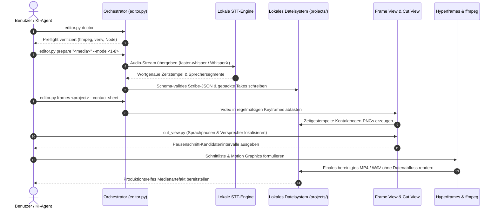

<p align="center"></p>

<p align="center">
  <a href="https://github.com/ellmos-ai/ai-media-editor"></a>
  <a href="https://github.com/ellmos-ai/ai-media-editor/actions/workflows/ci.yml"></a>
  <a href="https://github.com/ellmos-ai/ai-media-editor"></a>
  <a href="https://python.org"></a>
  <a href="https://github.com/ellmos-ai/ai-media-editor"></a>
  <a href="https://github.com/ellmos-ai/ai-media-editor"></a>
  <a href="https://github.com/ellmos-ai/ai-media-editor"></a>
  <a href="https://github.com/ellmos-ai/ai-media-editor/blob/main/SECURITY.md"></a>
  <a href="https://github.com/astral-sh/ruff"></a>
  <a href="https://github.com/ellmos-ai"></a>
  <a href="https://github.com/open-bricks"></a>
  <a href="llms.txt"></a>
  <a href="https://github.com/ellmos-ai/ai-media-editor"></a>
  <a href="LICENSE"></a>
</p>

<p align="center"><a href="README.md">English</a> · <strong>Deutsch</strong></p>

# ai-media-editor — lokaler KI-Medien-Editor (Video · Audio · Podcast)

> [!NOTE]
> **KI-/Agenten-native Integration:** `ai-media-editor` ist speziell für autonome Coding-Agenten (Claude Code, Gemini/Antigravity, Codex) konzipiert. Es bietet deterministische Projektvorbereitung, Scribe-JSON-Schemagenerierung und zeitgestempelte Frame-Kontaktbögen, damit LLMs Medien lokal visuell beurteilen und schneiden können — ohne Abhängigkeit von externen SaaS-Diensten.

### Schnellnavigation

| # | Abschnitt | Beschreibung |
|---|---|---|
| 01 | [Hauptfunktionen](#hauptfunktionen) | Orchestrator-Funktionen, lokales STT-Routing und Agenten-Toolstack |
| 02 | [Systemarchitektur-Ablaufdiagramm](#systemarchitektur-ablaufdiagramm) | 5-Ebenen-Systemtopologie von der Medienaufnahme bis zum deterministischen Export |
| 03 | [End-to-End Ausführungs-Sequenz](#end-to-end-ausführungs-sequenz) | Sequenzdiagramm zu Preflight, STT, Frame-Kontaktbögen und Schnittausführung |
| 04 | [Zielgruppen & Auffindbarkeit](#marketing--zielgruppen) | 4 Kern-Zielgruppenprofile (`[PERSONA-01]`–`[PERSONA-04]`) und High-Intent-Suchbegriffe |
| 05 | [Vergleichsmatrix gegenüber Alternativen](#vergleichsmatrix-gegenueber-alternativen) | 10-Dimensionen-Vergleichsmatrix gegenüber Cloud-SaaS, NLEs, CLI und gehosteten APIs |
| 06 | [Die 8 Anwendungsfälle](#die-8-anwendungsfälle) | Detaillierte Übersicht der Audio-, Video-, Explainer- und Werbeclip-Workflows |
| 07 | [Erste Schritte & Einrichtung](#erste-schritte--einrichtung) | Voraussetzungen, `<TOOLS_ROOT>`-Konfiguration und Initialisierung |
| 08 | [CLI-Referenz & Befehle](#cli-referenz--befehle) | Befehle für `doctor`, `modes`, `prepare` und `frames` im Überblick |
| 09 | [Motion Graphics & Musiksynthese](#motion-graphics--musiksynthese) | Hyperframes-Animationen und storylinebasierte NumPy-Wellenformsynthese |
| 10 | [Governance- & Laufzeit-Invarianten](#governance---laufzeit-invarianten) | 10 verbindliche Architektur-Garantien (`INV-LOCAL-01` bis `INV-SLA-10`) |
| 11 | [Sicherheit & Datenschutz-SLA](#sicherheit--datenschutz-sla) | 100% Local-First-Haltung, Zero-Egress, 48h Erstprüfung und 5-Tage-Triage-SLA |
| 12 | [Geschwisterprojekte & Ökosystem-Matrix](#geschwisterprojekte--ökosystem-matrix) | 16 Partner-Repositories aus `ellmos-ai`, `dev-bricks`, `file-bricks` und `open-bricks` |
| 13 | [Qualitätsprüfung & Tests](#qualitätsprüfung--tests) | Pytest-Suite, Ruff-Linter, Bytecode-Kompilierung und Fensterunterdrückung |
| 14 | [Maschinenlesbarer Kontext (`llms.txt`)](#maschinenlesbarer-kontext-llmstxt) | LLM-Crawler-Manifest, Suchbegriffe und Kontextregeln für KI-Agenten |
| 15 | [Repository-Struktur](#repository-struktur) | Detaillierte Verzeichnisübersicht für Code, Tools, STT, Tests und Projekte |
| 16 | [Changelog & Veröffentlichungen](#changelog--veröffentlichungen) | Versionshistorie, Meilensteine und Pfad-B-Auffindbarkeits-Updates |
| 17 | [Drittanbieter-Lizenzen & Transparenz](#drittanbieter-lizenzen--transparenz) | Open-Source-Inventar, Level 1 SBOM und RunAsInvoker-Zertifizierung |
| 18 | [Gesetzlicher Hinweis & Haftungsbeschränkung](#gesetzlicher-hinweis--haftungsbeschraenkung) | MIT-Lizenz, Haftungsausschluss nach § 521 BGB (Gefälligkeitsrecht) |

---

<a id="key-capabilities"></a><a id="1-key-capabilities"></a><a id="hauptfunktionen"></a><a id="1-hauptfunktionen"></a>
## 1. Hauptfunktionen

Einen KI-Coding-Agenten (z. B. Claude Code, Gemini, Codex) als Video-/Podcast-Editor einsetzen — mit **lokaler Transkription statt ElevenLabs Scribe**. Der Orchestrator (`editor.py`) übernimmt die deterministische Vorbereitung (Routing zur passenden STT-Engine/Compute, Scribe-JSON erzeugen, Takes packen); die kreative Schnitt- und Animationsarbeit fährt anschließend der Agent.

Ein Stack aus drei Werkzeugen:
- **video-use** — schneidet anhand des wortgenauen Transkripts (entfernt Pausen/Versprecher).
- **Hyperframes** — HTML/CSS/JS → MP4-Animationen und Motion Graphics.
- **`frontend-design`-Skill** — erzeugt Motion Graphics / Branding-Elemente.

…wobei die **ElevenLabs-Scribe-Transkription durch lokale Engines ersetzt** ist. Standard ist **faster-whisper** plus textbasierte LLM-Sprecherzuordnung für Gespräche; **WhisperX** ist die optionale Engine für akustische Diarisierung. Compute läuft standardmäßig lokal, optional mit **Remote-Host-primär, lokalem Fallback**. Der Ersatz schreibt genau die Scribe-Felder, die `video-use` verwendet — die nachgelagerten Helfer laufen dadurch ungepatcht weiter.

---

<a id="visual-architecture-flowchart"></a><a id="architecture-flowchart"></a><a id="systemarchitektur-ablaufdiagramm"></a><a id="2-visual-architecture-flowchart"></a><a id="2-systemarchitektur-ablaufdiagramm"></a>
## 2. Systemarchitektur-Ablaufdiagramm

```mermaid
flowchart TB
    subgraph Intake ["Ebene 1: Eingangskanäle & Medien-Aufnahme"]
        V["Roh-Video-Aufnahme (.mp4/.mov)"]
        A["Roh-Audio-Aufnahme (.wav/.m4a)"]
        S["Storyline-JSON (Narrativ & Emotion)"]
    end

    subgraph Preflight ["Ebene 2: Orchestrator & Preflight-Inspektion"]
        DOC["editor.py doctor<br/>Umgebungs- & Tooling-Prüfung"]
        MODES["editor.py modes<br/>8 Spezialisierte Medien-Anwendungsfälle"]
        PREP["editor.py prepare<br/>Projekt-Staging & Metadaten-Vertrag"]
    end

    subgraph Engines ["Ebene 3: Verarbeitungs- & Synthese-Engines"]
        FW["faster-whisper / WhisperX<br/>100% Lokale STT & Wort-Alignment"]
        DIAR["stt/diarize_llm.py<br/>Textbasierte Multi-Sprecher-Diarisierung"]
        MUSIC["tools/compose_music.py<br/>Prozedurale NumPy-Wellenformsynthese"]
        HF["Hyperframes & hide-windows.cjs<br/>HTML/CSS/JS -> MP4 Motion Graphics"]
    end

    subgraph Agentic ["Ebene 4: Agentische Interaktions-Ebene"]
        SCRIBE["Scribe-JSON-Schema<br/>Wortgenaues Timing für video-use"]
        FRAMES["tools/frame_view.py<br/>Zeitgestempelte Kontaktbögen"]
        CUTS["tools/cut_view.py<br/>Pausen- & Modulations-Schnittkandidaten"]
        LLM["KI-Coding-Agent<br/>(Claude Code / Gemini / Codex)"]
    end

    subgraph Export ["Ebene 5: Deterministischer Export & Artefakte"]
        OUT_V["Gerendertes Master-Video (.mp4)"]
        OUT_A["Bereinigtes sprechergetrenntes Audio (.wav)"]
        OUT_M["Standard-MIDI-Datei (.mid) & Partitur"]
    end

    Intake --> Preflight
    Preflight --> Engines
    Engines --> Agentic
    Agentic --> Export
```



---

<a id="end-to-end-execution-lifecycle-sequence"></a><a id="end-to-end-ausführungs-sequenz"></a><a id="3-end-to-end-execution-lifecycle-sequence"></a>
## 3. End-to-End Ausführungs-Sequenz



---

<a id="target-personas--discoverability"></a><a id="marketing--target-personas"></a><a id="zielgruppen--auffindbarkeit"></a><a id="marketing--zielgruppen"></a><a id="4-target-personas--discoverability"></a>
## 4. Zielgruppen & Auffindbarkeit

`ai-media-editor` löst zentrale Workflow-Engpässe moderner KI-Medien-Automatisierung für vier dedizierte Zielgruppen:

### [PERSONA-01] Autonome KI-Coding-Agenten-Entwickler & Schwarm-Architekten
- **Profil:** Software-Entwickler, die Multi-Agenten-Pipelines (Claude Code, Gemini/Antigravity, Codex CLI, Kimi Code) für autonome Medienproduktion steuern.
- **Problem:** Proprietäre Cloud-STT-Dienste setzen API-Ratenlimits, erzwingen fehleranfällige Browser-Automationen und leiten vertrauliche, unveröffentlichte Medien an externe Server weiter.
- **Lösung:** Reine CLI-Orchestrierung mit deterministischer Scribe-JSON-Schemagenerierung, Pausenschnitt-Kandidaten und visuellen Kontaktbögen direkt für Multimodal-LLMs.
- **High-Intent-Suchbegriff:** `"agent driven video editor with local transcription"`

### [PERSONA-02] Local-First Podcaster & Content-Produzenten
- **Profil:** Unabhängige Podcaster, Interviewer und Video-Creators mit regelmäßigen Veröffentlichungen.
- **Problem:** Hohe monatliche Abo-Kosten für Cloud-SaaS-Editoren (Descript, Riverside) und lange Uploadzeiten bei mehrstündigen Rohaufnahmen.
- **Lösung:** 100% offline faster-whisper-Transkription, sprechergetrennte Audio-Spuren, automatische Pausenbereinigung und prozedurale Vinyl-/Wellenform-Covervideos.
- **High-Intent-Suchbegriff:** `"local first podcast editing AI agent workflow"`

### [PERSONA-03] KI-Video- & Motion-Graphics-Entwickler
- **Profil:** Frontend-Entwickler und Motion-Designer, die visuelle Video-Assets programmatisch generieren möchten.
- **Problem:** Klassische NLEs (Premiere, After Effects) bieten keine sauberen Code-Schnittstellen und können Animationen nicht direkt aus CSS-/HTML-Design-Tokens erzeugen.
- **Lösung:** Direkte Hyperframes-Integration: Wandelt HTML/CSS/JavaScript-Komponenten in 60fps-MP4-Motion-Graphics um — mit unterdrückten Windows-Konsolenfenstern.
- **High-Intent-Suchbegriff:** `"Hyperframes motion graphics podcast editor"`

### [PERSONA-04] Sicherheits-, Datenschutz- & Compliance-Verantwortliche
- **Profil:** Datenschutz- und Compliance-Beauftragte in regulierten Branchen (Medizin, Recht, Finanzen).
- **Problem:** Gesetzliche Vorgaben (DSGVO Art. 28, Berufsgeheimnis, vertrauliche M&A-Audits) verbieten das Hochladen interner Aufnahmen auf fremde Cloud-Plattformen strikt.
- **Lösung:** Nachweisbare Zero-Egress-Garantie (`INV-LOCAL-01`), unprivilegierte `RunAsInvoker`-Ausführung (`INV-RUNAS-02`), Level 1 SBOM und ein verbindliches 48h-Sicherheits-SLA.
- **High-Intent-Suchbegriff:** `"zero egress video transcription and cutting"`

---

<a id="comparative-matrix-vs-alternatives"></a><a id="comparative-matrix--alternatives"></a><a id="vergleichsmatrix-gegenueber-alternativen"></a><a id="5-comparative-matrix-vs-alternatives"></a>
## 5. Vergleichsmatrix gegenüber Alternativen

Die folgende 10-Dimensionen-Matrix vergleicht `ai-media-editor` mit etablierten und konkurrierenden Ansätzen entlang unserer verbindlichen Laufzeit-Invarianten:

| Dimension & Invariante | ai-media-editor | Cloud-SaaS (Descript / ElevenLabs) | Kommerzielle NLEs (Premiere / DaVinci) | Rohe CLI / Shell (FFmpeg) | Gehostete APIs (Whisper API / Google STT) |
|---|:---:|:---:|:---:|:---:|:---:|
| **1. Local-First & Zero Egress (`INV-LOCAL-01`)** | :white_check_mark: 100% Offline Lokal | :x: Zwingender Cloud-Upload | :warning: Lokal (proprietäre Telemetrie) | :white_check_mark: 100% Offline Lokal | :x: Externe Cloud-Verarbeitung |
| **2. Unprivilegierte Ausführung (`INV-RUNAS-02`)** | :white_check_mark: `RunAsInvoker` Standard | :warning: Browser / Hilfsanwendung | :warning: Admin-Installer / Hintergrunddienst | :white_check_mark: Standard-Benutzerrechte | :white_check_mark: API-Client-Ebene |
| **3. Zerstörungsfreie Quellmedien (`INV-PREV-03`)** | :white_check_mark: Schreibgeschützte Medien | :warning: Cloud-Medienduplikation | :white_check_mark: Zerstörungsfreie Projekte | :warning: Versehentliches Überschreiben | :white_check_mark: Quellmedien unverändert |
| **4. Deterministische Synthese (`INV-DETERM-04`)** | :white_check_mark: Scribe-JSON & Seed-Score | :x: Stochastische Cloud-Änderungen | :warning: Komplexer Projektstatus | :warning: Unstrukturierte Ausgaben | :x: Schwankende Latenzen |
| **5. Pfad-Isolation & Jail (`INV-BOUNDARY-05`)** | :white_check_mark: Strikte Projekt-Eindämmung | :warning: Gehosteter Cloud-Speicher | :warning: Beliebiges Dateisystem | :x: Keine Pfad-Validierung | :white_check_mark: Mandantengrenze |
| **6. Konsolenfenster-Unterdrückung (`INV-SUBPROC-06`)** | :white_check_mark: `windowsHide` vorinstalliert | :heavy_minus_sign: N/A (Web-Oberfläche) | :heavy_minus_sign: N/A (Desktop-GUI) | :x: Aufflackernde Konsolenfenster | :heavy_minus_sign: N/A (HTTP-Aufrufe) |
| **7. Plattformübergreifende Parität (`INV-PARITY-07`)** | :white_check_mark: Windows, Linux, macOS | :warning: Browser-abhängig | :x: Betriebssystem-Sonderwege | :white_check_mark: POSIX / Windows | :white_check_mark: Plattformunabhängig |
| **8. Multi-Agenten-Synchronisation (`INV-SYNC-08`)** | :white_check_mark: Lock-Disziplin & sauberes Git | :x: Einzelnutzer-SaaS-Sitzung | :x: Einzelplatz-Projektsperren | :warning: Gleichzeitige Schreibkonflikte | :warning: Ratenbegrenzungen (Rate-Limits) |
| **9. KI-Agenten-Lesbarkeit (`INV-DOCS-09`)** | :white_check_mark: Scribe-JSON, Kontaktbögen, `llms.txt` | :x: Geschlossenes Web-DOM | :x: Binäre Projektformate | :warning: Rohe Text-Logs | :warning: Reine Transkripte |
| **10. Sicherheits-Reaktions-SLA (`INV-SLA-10`)** | :white_check_mark: 48h Reaktion / 5d Triage | :warning: Support-Ticketschlange | :warning: Quartalsweise Updates | :heavy_minus_sign: Ungepflegte Einzelskripte | :warning: Allgemeines Cloud-SLA |

Detaillierte Marketing-Analyse, Suchbegriffe und Audit-Protokoll: [`MARKETING-LOG.txt`](MARKETING-LOG.txt).

---

<a id="the-8-production-usecases"></a><a id="the-8-usecases"></a><a id="die-8-anwendungsfälle"></a><a id="6-the-8-production-usecases"></a>
## 6. Die 8 Anwendungsfälle

| # | Input | Sprecher | Output | Typischer Ablauf |
|---|---|---|---|---|
| 1 | Audio | 1 | Audio-Podcast geschnitten | Einzelschnitt, Pausen bereinigen, Versprecher entfernen |
| 2 | Audio | mehrere | Audio-Podcast sprechergetrennt | Multi-Track-Podcast mit Diarisierung bereinigen |
| 3 | Video (A+V) | 1 | Videoschnitt + Animationen | Talking Head mit automatisierten Hyperframes-Bauchbinden |
| 4 | Video (A+V) | mehrere | Video + Animationen + Sprechertracking | Interview-Video mit dynamischen Sprechereinblendungen |
| 5 | Video → nur Audio | 1/mehrere | Audio-Podcast (Video verworfen) | Extrahieren eines sauberen Audio-Podcasts aus Videomaterial |
| 6 | Audio | 1/mehrere | Komplett generiertes Erklärvideo | Sprachspur mit KI-generierten Motion-Graphics-Visuals |
| 7 | Audio | 1 | Audio + animiertes Cover | Podcast-Spur über animierter Vinyl-/Wellenform-Schleife |
| 8 | Audio/Briefing | 1 | Werbeclip (15–60 s, 16:9 + 9:16) | Schnelle Kurzclip-Fabrik über Hyperframes |

Schritt-für-Schritt-Anleitung für jeden Modus: [`docs/USECASES.md`](docs/USECASES.md).

---

<a id="getting-started--setup"></a><a id="erste-schritte--einrichtung"></a><a id="7-getting-started--setup"></a>
## 7. Erste Schritte & Einrichtung

1. **Konfiguration erstellen:** `config/settings.example.json` nach `config/settings.json` kopieren und Optionen anpassen (`local`/`mac`, Engines, `paths.*`).
2. **Tools-Verzeichnis (`<TOOLS_ROOT>`):** In `paths.tools_root` den Pfad für schwere Tools (`video-use`, ffmpeg, Node ≥ 22) eintragen. **Nicht** in einem cloud-synchronisierten Ordner ablegen.
3. **Externe Voraussetzungen:**
   - **Lokal:** `ffmpeg`, `Node.js >= 22` (für Hyperframes), Python 3.10–3.13 venv.
   - **Optionaler Remote-Host:** faster-whisper + WhisperX auf einem per SSH erreichbaren Rechner.
   - **HuggingFace-Token:** Nur nötig, wenn `engines.multi_speaker` auf `whisperx` steht.

---

<a id="cli-reference--commands"></a><a id="cli-referenz--befehle"></a><a id="8-cli-reference--commands"></a>
## 8. CLI-Referenz & Befehle

```bash
# Python-venv-Pfad setzen
VENV="<TOOLS_ROOT>/.venv/Scripts/python.exe"

# 1. Umgebungs- und Toolchain-Prüfung
PYTHONIOENCODING=utf-8 "$VENV" editor.py doctor

# 2. Unterstützte Anwendungsfälle anzeigen
PYTHONIOENCODING=utf-8 "$VENV" editor.py modes

# 3. Medienprojekt vorbereiten (deterministische Transkription + Takes packen)
PYTHONIOENCODING=utf-8 "$VENV" editor.py prepare "/pfad/zu/aufnahme.mp4" --mode 3 --project mein-video

# 4. Zeitgestempelte Frame-Kontaktbögen für LLM-Sichtung generieren
PYTHONIOENCODING=utf-8 "$VENV" editor.py frames mein-video --contact-sheet

# 5. Detailliertes Frame-Intervall extrahieren
PYTHONIOENCODING=utf-8 "$VENV" editor.py frames mein-video --from 30 --to 45 --step 0.25
```

---

<a id="motion-graphics--music-synthesis"></a><a id="motion-graphics--musiksynthese"></a><a id="9-motion-graphics--music-synthesis"></a>
## 9. Motion Graphics & Musiksynthese

### Lokale videosynchrone Begleitmusik (`compose_music.py`)
`tools/compose_music.py` komponiert Begleitmusik passend zu einer Video-Storyline — 100 % lokal ohne Cloud-Dienste.
Eingabe ist ein **Storyline-JSON**, das Abschnitte mit exakten Zeitfenstern, Stimmungen und Intensitäten definiert:

```bash
# Musik aus Storyline-JSON komponieren
python tools/compose_music.py docs/examples/storyline-roshambo.json -o projects/<name>/assets/score

# Storyline-Vorlage generieren
python tools/compose_music.py --init

# Deterministischen Synthese-Selbsttest ausführen
python tools/compose_music.py --selftest
```

Ausgabe: Stereo-WAV + MP3 + `<name>.notes.json` + `<name>.mid` (Standard MIDI File Typ 1).

### MIDI-Export & High-Fidelity Rendering
Der MIDI-Export erlaubt verlustfreies Rendering über professionelle SoundFonts:
- **Pfad A — SoundFont (lokal, kostenlos):** FluidSynth (`winget install FluidSynth`) + GeneralUser GS / MuseScore_General:
  `fluidsynth -ni soundfont.sf2 out.mid -F out.wav -r 44100`
- **Pfad B — Orchester-Libraries:** VSCO 2 Community Edition oder Salamander Grand Piano.

---

<a id="governance--runtime-invariants"></a><a id="governance---laufzeit-invarianten"></a><a id="10-governance--runtime-invariants"></a>
## 10. Governance- & Laufzeit-Invarianten

Die Architektur garantiert 10 unverletzliche Laufzeit-Zusicherungen über alle Betriebsmodi:

| Invarianten-ID | Fachbereich | Garantie & Durchsetzungsregel | Verifikations-Mechanismus |
|---|---|---|---|
| `INV-LOCAL-01` | Datenschutz & Egress | **100% Local-First-Ausführung**: Rohdaten, Transkripte und Embeddings verlassen niemals den localhost. Keine Cloud-Aufrufe. | `tests/test_core.py`, keine Cloud-Sockets in der Pipeline |
| `INV-RUNAS-02` | Rechte & Sandbox | **Unprivilegierter Benutzermodus (`RunAsInvoker`)**: Keine administrativen Rechte oder Root-Elevation erforderlich. | Standard-Benutzerrechte in allen Skripten |
| `INV-PREV-03` | Speicher & Immutabilität | **Zerstörungsfreie Quellmedien**: Eingabedateien sind strikt schreibgeschützt; Artefakte landen nur in `projects/<name>/`. | Isolationsprüfungen in `tests/test_core.py` |
| `INV-DETERM-04` | Reproduzierbarkeit | **Deterministische Synthese & Schematreue**: Fester Seed für prozedurales Audio und strikte Scribe-JSON-Konformität. | `tests/test_compose_music.py`, `stt/scribe_schema.py` |
| `INV-BOUNDARY-05` | Pfad-Sicherheit | **Anti-Traversal & Projekt-Isolation**: Dateinamen und Projekt-Stems können die Projektgrenzen nicht verlassen. | `test_project_names_cannot_escape_projects` |
| `INV-SUBPROC-06` | Prozess-Hygiene | **Sauberer Lebenszyklus & Fensterunterdrückung**: Preload-Wrapper unterdrücken aufploppende Konsolenfenster unter Windows. | `tools/hf.cmd`, `tools/hide-windows.cjs` |
| `INV-PARITY-07` | Multi-OS-Unterstützung | **Plattformübergreifende OS-Parität**: Identische Ausführung und Pfadbehandlung unter Windows, Linux und macOS. | Multi-OS GitHub Actions CI-Matrix |
| `INV-SYNC-08` | Nebenläufigkeit & Locks | **Cloud-Sync- & Multi-Agenten-Lock-Disziplin**: Schwere Tools und Projekte sind von Cloud-Sync-Konflikten ausgeschlossen. | `.gitignore`-Konflikt- und Lock-Filterregeln |
| `INV-DOCS-09` | Barrierefreiheit & Discovery | **Multimodale LLM-Bereitschaft & zweisprachige Parität**: Kontaktbögen für Vision-LLMs; 1:1 DE/EN-Dokumentationsparität. | `llms.txt`, `README.md`, `README_de.md` Vertragstests |
| `INV-SLA-10` | Sicherheit & Reaktion | **48h Sicherheitsreaktion & 5-Tage-Triage-SLA**: Strukturierte Schwachstellenmeldung über GitHub Advisories und Betreuer-E-Mails. | `SECURITY.md`, `test_security_policy_bilingual_parity` |

---

<a id="security--privacy-sla"></a><a id="sicherheit--datenschutz-sla"></a><a id="11-security--privacy-sla"></a>
## 11. Sicherheit & Datenschutz-SLA

- **Local-First Datenschutz**: Transkription, Frame-Extraktion und Schnittberechnung laufen vollständig offline auf lokaler Hardware.
- **Eindämmung sensibler Medien**: Quellaufnahmen und Projektausgaben verbleiben strikt im lokalen Verzeichnis `projects/` (gitignored).
- **Sicherheits-Reaktionsverpflichtung**:
  - **Erstprüfungs-SLA**: Innerhalb von 48 Stunden zur Bestätigung eingereichter Sicherheitsberichte.
  - **Technische Triage-SLA**: Innerhalb von 5 Werktagen mit Schweregrad-Einstufung.
  - **Meldekanäle**: [GitHub Security Advisories](https://github.com/ellmos-ai/ai-media-editor/security/advisories) oder direkte E-Mail an `security@open-bricks.org`, `security@ellmos.ai`, `support@lukasgeiger.com` und `lukas@open-bricks.org`.
  - Ausführliche Richtlinie: [`SECURITY.md`](SECURITY.md).

---

<a id="sibling-projects--ecosystem-matrix"></a><a id="geschwisterprojekte--ökosystem-matrix"></a><a id="12-sibling-projects--ecosystem-matrix"></a>
## 12. Geschwisterprojekte & Ökosystem-Matrix

`ai-media-editor` ist als spezialisierte Multimedia-Orchestrierungs-Engine in das `open-bricks`- und `ellmos-ai`-Ökosystem eingebettet:

| Repository | Organisation | Domäne / Zweck | Ökosystem-Zusammenspiel |
|---|---|---|---|
| [`clip-storyboard-director`](https://github.com/ellmos-ai/clip-storyboard-director) | `ellmos-ai` | Generativer Storyboard- und Szenen-Director | Szenensequenz-Generierung für Videoprojekte |
| [`assistant-core`](https://github.com/ellmos-ai/assistant-core) | `ellmos-ai` | Konversations-Supervision & Agenten-Laufzeit | Steuerung autonomer Medienschnitt-Aufgaben |
| [`decision-clicker`](https://github.com/ellmos-ai/decision-clicker) | `ellmos-ai` | Interaktives Benutzerentscheidungs-Gateway | Überprüfung von Schnittkandidaten und Entscheidungen |
| [`lock-master`](https://github.com/ellmos-ai/lock-master) | `ellmos-ai` | Fail-Closed Multi-Agenten-Sperrsystem | Schutz paralleler Projektdateien und Render-Sperren |
| [`clutch`](https://github.com/ellmos-ai/clutch) | `ellmos-ai` | Prozess-Supervisor und Aufgaben-Scheduler | Überwachung rechenintensiver Rendering- und STT-Jobs |
| [`system-explorer`](https://github.com/ellmos-ai/system-explorer) | `ellmos-ai` | Lokale Hardware- und Fähigkeitserkennung | Erkennung von GPU-, CUDA- und Hardware-Beschleunigung |
| [`roblox-studio-core`](https://github.com/ellmos-ai/roblox-studio-core) | `ellmos-ai` | Headless 3D-Studio-Aufnahme und -Automatisierung | 3D-Grafik-Assets und Animationsframes |
| [`usb-podcast-studio`](https://github.com/entertain-and-more/usb-podcast-studio) | `entertain-and-more` | USB-Audio-Hardwareaufnahme & Broadcast | Hochwertige Aufnahmequelle für Podcast-Modi |
| [`BattleStage`](https://github.com/entertain-and-more/BattleStage) | `entertain-and-more` | Server-autoritative Physiksimulation | Spielszenen- und Replay-Videoberechnung |
| [`DevCenter`](https://github.com/dev-bricks/DevCenter) | `dev-bricks` | Entwicklerumgebung & Arbeitsbereichsverwaltung | Verwaltung lokaler Tools und Entwicklungsumgebungen |
| [`MethodenAnalyser`](https://github.com/dev-bricks/MethodenAnalyser) | `dev-bricks` | Statische Python-Metriken & Methoden-Audit | Codequalitäts-Audit der Editor-Module |
| [`ExplorerPro`](https://github.com/file-bricks/ExplorerPro) | `file-bricks` | Hochgeschwindigkeits-Dateimanager (PySide6) | Visuelle Projektübersicht und Mediendatei-Organisation |
| [`ProFiler`](https://github.com/file-bricks/ProFiler) | `file-bricks` | Tiefe Verzeichnis- und Mediendatei-Analyse | Medien-Asset-Indizierung und Cache-Bereinigung |
| [`CloudLockFixer`](https://github.com/file-bricks/CloudLockFixer) | `file-bricks` | Multi-Host-Synchronisations-Konfliktbereinigung | Bereinigung verwaister Locks und Cloud-Konfliktkopien |
| [`FormularErstellen`](https://github.com/doc-bricks/FormularErstellen) | `doc-bricks` | Dynamischer PDF- und Formular-Layout-Generator | Erstellung von Projektberichten und Produktionsübersichten |
| [`open-bricks`](https://github.com/open-bricks/open-bricks) | `open-bricks` | Dachorganisation für Open-Source-Standards | Kanonische Ökosystem-Governance & Lizenzparität |

---

<a id="quality-gates--testing"></a><a id="qualitätsprüfung--tests"></a><a id="13-quality-gates--testing"></a>
## 13. Qualitätsprüfung & Tests

Schnelle lokale Qualitätsprüfungen ohne externe STT-Modelle oder schwere Mediendateien:

```bash
# Vollständige Test-Suite ausführen
python -m pytest -ra -v

# Code-Linting ausführen
ruff check .

# Bytecode-Kompilierung validieren
python -m compileall -q .

# CLI-Modi verifizieren
python editor.py modes
```

### Windows-Konsolenfenster-Unterdrückung
Hyperframes und Node-Subprozesse laufen über `tools/hf.cmd` und `tools/hide-windows.cjs` mit erzwungenem `windowsHide: true`. Das verhindert störendes Aufploppen von Konsolenfenstern beim Rendern. Hintergrunddetails: [`docs/WINDOWS-KONSOLENFENSTER.md`](docs/WINDOWS-KONSOLENFENSTER.md).

---

<a id="machine-readable-context-llmstxt"></a><a id="maschinenlesbarer-kontext-llmstxt"></a><a id="14-machine-readable-context-llmstxt"></a>
## 14. Maschinenlesbarer Kontext (`llms.txt`)

LLM-Crawler, Code-Assistenten und automatisierte Indizierungs-Agenten können den Kontext des Repositories direkt über [`llms.txt`](llms.txt) einlesen.

Wichtige Suchbegriffe:
```text
ellmos-ai/ai-media-editor
local AI media editor video podcast transcription
agent driven video editor with local transcription
Claude Code video podcast editor Hyperframes
faster-whisper WhisperX Scribe JSON video-use
transcript based video cutting local first
Hyperframes motion graphics podcast editor
offline procedural music synthesis storyline numpy
zero egress video transcription and cutting
```

---

<a id="repository-structure"></a><a id="repository-struktur"></a><a id="15-repository-structure"></a>
## 15. Repository-Struktur

```
ai-media-editor/                  (Code/Doku/Projekte)
├── CLAUDE.md                     ← Agenten-Leitfaden (Editor-Workflow, Deutsch)
├── README.md                     ← Englische Übersicht & 18-Punkte-Architektur
├── README_de.md                  ← Deutsche Dokumentation (1:1 Anker-Parität)
├── editor.py                     ← Orchestrator (prepare / frames / modes / doctor)
├── tools/
│   ├── cut_view.py               ← Pausen als explizite Schnittkandidaten
│   ├── frame_view.py             ← Video → zeitgestempelte Frames ("Video-Scatterer", UC3/4/8)
│   ├── compose_cover.py          ← UC7: Cover über Audio loopen
│   ├── compose_music.py          ← Storyline-JSON → videosynchroner Score (NumPy-Synthese)
│   ├── hf.cmd / hf-hidden.vbs    ← Wrapper zur Unterdrückung von Konsolenfenstern unter Windows
│   └── hide-windows.cjs          ← Node.js-Preload-Skript für windowsHide: true
├── stt/
│   ├── scribe_schema.py          ← Scribe-JSON-Format (Schnittstelle zu video-use)
│   ├── transcribe_local.py       ← faster-whisper + WhisperX → Scribe-JSON
│   ├── diarize_llm.py            ← Token-freie textbasierte Sprecherzuordnung
│   └── mac_remote.py             ← Compute-Routing (Remote primär, lokaler Fallback)
├── config/settings.example.json  ← Vorlage: Compute, Engines, Modelle, Pfade, HF-Token
├── brand/design-tokens.css       ← Branding-Tokens für generierte Animationen
├── docs/USECASES.md              ← Schritt-für-Schritt-Anleitung pro Modus
├── production/                   ← Optionale generative Workflows (Cloud-Gates gelten)
├── tests/
│   ├── test_core.py              ← Abhängigkeitsfreie Regressions-Suite
│   ├── test_compose_music.py     ← Storyline- & Wellenform-Synthese-Tests
│   └── test_metadata.py          ← Automatisierte Vertragstests für Manifeste & Auffindbarkeit
├── SECURITY.md                   ← Sicherheitsrichtlinie und Meldewege
├── THIRD_PARTY_LICENSES.md       ← Level 1 SBOM und Drittanbieter-Lizenzinventar
├── MARKETING-LOG.txt             ← Auffindbarkeit, Personas, Vergleichsmatrix & Architektur-Audit
└── projects/<name>/edit/         ← Pro Projekt: Transkripte, gepackte Takes (gitignored)

<TOOLS_ROOT>/                     (KEIN Cloud-Ordner — venv/Tools)
├── .venv/                        ← Python-venv (faster-whisper, video-use, …)
└── video-use/                    ← Geklontes browser-use/video-use (ungepatcht)
```

---

<a id="changelog--releases"></a><a id="changelog--veröffentlichungen"></a><a id="16-changelog--releases"></a>
## 16. Changelog & Veröffentlichungen

Vollständige Versionshistorie in [`CHANGELOG.md`](CHANGELOG.md).
- **Version 0.2.3 (2026-09-20)**: Pfad B visuelle Architektur & Auffindbarkeits-Überholung, 18-Punkte-Doppelnavigations-Parität, 10-Dimensionen-Vergleichsmatrix vs. 4 Alternativen, 4 formalisierte Zielgruppen (`[PERSONA-01]` bis `[PERSONA-04]`), Level 1 SBOM Invarianten-Kreuztabelle in `THIRD_PARTY_LICENSES.md`, `RunAsInvoker`-Zertifizierung und gesetzlicher Hinweis nach § 521 BGB.
- **Version 0.2.2 (2026-09-12)**: Pfad A technische Repository-Hygiene, CI-Runner-Timeout-Schutz (`timeout-minutes: 15`), automatisiertes Stale-Issues/PRs-Management, gehärtete `.gitignore` und optionale Dependency-Gruppen in `pyproject.toml`.
- **Version 0.2.1 (2026-09-11)**: Auffindbarkeits-Update, dediziertes Drittanbieter-Lizenzaudit, PEP 621 erweiterte URLs und erste Vertragstest-Suite.
- **Version 0.2.0 (2026-09-09)**: Gehärtete Local-First-Pipeline, automatisierte Vertragstests, Multi-OS CI-Matrix, zweisprachige Parität, duale Mermaid-Diagramme und 10 Governance-Invarianten.

---

<a id="level-1-sbom--third-party-licenses"></a><a id="third-party-licenses--transparency"></a><a id="drittanbieter-lizenzen--transparenz"></a><a id="17-level-1-sbom--third-party-licenses"></a>
## 17. Drittanbieter-Lizenzen & Transparenz

`ai-media-editor` ist mit kompromisslosem Bekenntnis zu Open-Source-Transparenz, unprivilegierter Ausführung und Offline-Reproduzierbarkeit gebaut:

- **100% Permissive Open-Source**: Alle integrierten Bibliotheken, Engines und Runtimes stehen unter permissiven Open-Source-Lizenzen (MIT, Apache-2.0, BSD, PSFL) oder dynamisch gelinkten Medien-Tools (FFmpeg LGPL). Es gibt keinerlei proprietäre Sperren oder geschlossene Telemetrie.
- **Keine Cloud-Laufzeitabhängigkeiten (`INV-LOCAL-01`)**: Transkription, Frame-Extraktion, Pausenerkennung und prozedurale Musiksynthese laufen 100% offline auf eigener Hardware.
- **Unprivilegierte Ausführung (`INV-RUNAS-02`)**: Alle Komponenten laufen ausschließlich unter normalen Benutzerkonten (`RunAsInvoker`), ohne Administrator- oder Root-Rechte zu fordern.
- **Level 1 SBOM & Invarianten-Zuordnung**: Upstream-Quellen, Maintainer, Lizenztexte und zugeordnete Invarianten sind in [`THIRD_PARTY_LICENSES.md`](THIRD_PARTY_LICENSES.md) detailliert erfasst.
- **Kernprojekt-Lizenz**: [MIT License](LICENSE) © 2026 ellmos-ai / open-bricks.

---

<a id="statutory-notice--liability-limitation"></a><a id="gesetzlicher-hinweis--haftungsbeschraenkung"></a><a id="18-statutory-notice--liability-limitation"></a>
## 18. Gesetzlicher Hinweis & Haftungsbeschränkung

Diese Software wird kostenlos unter der MIT-Lizenz als Open-Source-Software bereitgestellt. Gemäß deutschem Gesetzesrecht (§ 521 BGB - Schenkungs- und Gefälligkeitsrecht) ist die Haftung bei unentgeltlicher Überlassung auf Vorsatz (*Vorsatz*) und grobe Fahrlässigkeit (*grobe Fahrlässigkeit*) beschränkt. Insbesondere wird keine Gewährleistung für die Eignung für einen bestimmten Zweck, Marktgängigkeit oder Fehlerfreiheit übernommen.
