<p align="center"></p>

<p align="center">
  <a href="https://github.com/ellmos-ai/ai-media-editor"></a>
  <a href="https://github.com/ellmos-ai/ai-media-editor/actions/workflows/ci.yml"></a>
  <a href="https://github.com/ellmos-ai/ai-media-editor"></a>
  <a href="https://python.org"></a>
  <a href="https://github.com/ellmos-ai/ai-media-editor"></a>
  <a href="https://github.com/ellmos-ai/ai-media-editor"></a>
  <a href="https://github.com/ellmos-ai/ai-media-editor"></a>
  <a href="https://github.com/ellmos-ai/ai-media-editor/blob/main/SECURITY.md"></a>
  <a href="https://github.com/astral-sh/ruff"></a>
  <a href="https://github.com/ellmos-ai"></a>
  <a href="https://github.com/open-bricks"></a>
  <a href="llms.txt"></a>
  <a href="https://github.com/ellmos-ai/ai-media-editor"></a>
  <a href="LICENSE"></a>
</p>

<p align="center"><a href="README.md">English</a> · <strong>Deutsch</strong></p>

# ai-media-editor — lokaler KI-Medien-Editor (Video · Audio · Podcast)

> [!NOTE]
> **KI-/Agenten-native Integration:** `ai-media-editor` ist speziell für autonome Coding-Agenten (Claude Code, Gemini/Antigravity, Codex) konzipiert. Es bietet deterministische Projektvorbereitung, Scribe-JSON-Schemagenerierung und zeitgestempelte Frame-Kontaktbögen, damit LLMs Medien lokal visuell beurteilen und schneiden können — ohne Abhängigkeit von externen SaaS-Diensten.

### Schnellnavigation
1. [Hauptfunktionen](#hauptfunktionen)
2. [Systemarchitektur-Ablaufdiagramm](#systemarchitektur-ablaufdiagramm)
3. [End-to-End Ausführungs-Sequenz](#end-to-end-ausführungs-sequenz)
4. [Die 8 Anwendungsfälle](#die-8-anwendungsfälle)
5. [Erste Schritte & Einrichtung](#erste-schritte--einrichtung)
6. [CLI-Referenz & Befehle](#cli-referenz--befehle)
7. [Motion Graphics & Musiksynthese](#motion-graphics--musiksynthese)
8. [Governance- & Laufzeit-Invarianten](#governance---laufzeit-invarianten)
9. [Sicherheit & Datenschutz-SLA](#sicherheit--datenschutz-sla)
10. [Geschwisterprojekte & Ökosystem-Matrix](#geschwisterprojekte--ökosystem-matrix)
11. [Qualitätsprüfung & Tests](#qualitätsprüfung--tests)
12. [Maschinenlesbarer Kontext (`llms.txt`)](#maschinenlesbarer-kontext-llmstxt)
13. [Changelog & Veröffentlichungen](#changelog--veröffentlichungen)
14. [Drittanbieter-Lizenzen & Transparenz](#drittanbieter-lizenzen--transparenz)
15. [Marketing & Zielgruppen](#marketing--zielgruppen)

---

## Hauptfunktionen

Einen KI-Coding-Agenten (z. B. Claude Code) als Video-/Podcast-Editor einsetzen — mit **lokaler Transkription statt ElevenLabs Scribe**. Der Orchestrator (`editor.py`) übernimmt die deterministische Vorbereitung (Routing zur passenden STT-Engine/Compute, Scribe-JSON erzeugen, Takes packen); die kreative Schnitt- und Animationsarbeit fährt anschließend der Agent.

Ein Stack aus drei Werkzeugen:
- **video-use** — schneidet anhand des wortgenauen Transkripts (entfernt Pausen/Versprecher).
- **Hyperframes** — HTML/CSS/JS → MP4-Animationen und Motion Graphics.
- **`frontend-design`-Skill** — erzeugt Motion Graphics / Branding-Elemente.

…wobei die **ElevenLabs-Scribe-Transkription durch lokale Engines ersetzt** ist. Standard ist **faster-whisper** plus textbasierte LLM-Sprecherzuordnung für Gespräche; **WhisperX** ist die optionale Engine für akustische Diarisierung. Compute läuft standardmäßig lokal, optional mit **Remote-Host-primär, lokalem Fallback**. Der Ersatz schreibt genau die Scribe-Felder, die `video-use` verwendet — die nachgelagerten Helfer laufen dadurch ungepatcht weiter.

### Repository-Struktur
```
ai-media-editor/                  (Code/Doku/Projekte)
├── CLAUDE.md                     ← Agenten-Leitfaden (Editor-Workflow, Deutsch)
├── README.md                     ← Englische Übersicht & visuelle Architektur
├── README_de.md                  ← Deutsche Dokumentation (1:1 Parität)
├── editor.py                     ← Orchestrator (prepare / frames / modes / doctor)
├── tools/
│   ├── cut_view.py               ← Pausen als explizite Schnittkandidaten
│   ├── frame_view.py             ← Video → zeitgestempelte Frames ("Video-Scatterer", UC3/4/8)
│   ├── compose_cover.py          ← UC7: Cover über Audio loopen
│   └── compose_music.py          ← Storyline-JSON → videosynchroner Score (NumPy-Synthese)
├── stt/
│   ├── scribe_schema.py          ← Scribe-JSON-Format (Schnittstelle zu video-use)
│   ├── transcribe_local.py       ← faster-whisper + WhisperX → Scribe-JSON
│   └── mac_remote.py             ← Compute-Routing (Remote primär, lokaler Fallback)
├── config/settings.example.json  ← Vorlage: Compute, Engines, Modelle, Pfade, HF-Token
├── brand/design-tokens.css       ← Branding-Tokens für generierte Animationen
├── docs/USECASES.md              ← Schritt-für-Schritt-Anleitung pro Modus
├── production/                   ← Optionale generative Workflows (Cloud-Gates gelten)
├── tests/
│   ├── test_core.py              ← Abhängigkeitsfreie Regressions-Suite
│   ├── test_compose_music.py     ← Storyline- & Wellenform-Synthese-Tests
│   └── test_metadata.py          ← Automatisierte Vertragstests für Manifeste & Auffindbarkeit
├── SECURITY.md                   ← Sicherheitsrichtlinie und Meldewege
├── THIRD_PARTY_LICENSES.md       ← Inventar externer Open-Source-Komponenten
├── MARKETING-LOG.txt             ← Auffindbarkeit, Marketing-Personas & Architektur-Audit
└── projects/<name>/edit/         ← Pro Projekt: Transkripte, gepackte Takes (gitignored)

<TOOLS_ROOT>/                     (KEIN Cloud-Ordner — venv/Tools)
├── .venv/                        ← Python-venv (faster-whisper, video-use, …)
└── video-use/                    ← Geklontes browser-use/video-use (ungepatcht)
```

---

## Systemarchitektur-Ablaufdiagramm

```mermaid
flowchart TB
    subgraph Intake ["Ebene 1: Eingangskanäle & Medien-Aufnahme"]
        V["Roh-Video-Aufnahme (.mp4/.mov)"]
        A["Roh-Audio-Aufnahme (.wav/.m4a)"]
        S["Storyline-JSON (Narrativ & Emotion)"]
    end

    subgraph Preflight ["Ebene 2: Orchestrator & Vorabprüfung"]
        DOC["editor.py doctor<br/>Umgebungs- & Tooling-Prüfung"]
        MODES["editor.py modes<br/>8 spezialisierte Medien-Usecases"]
        PREP["editor.py prepare<br/>Projekt-Staging & Metadaten-Vertrag"]
    end

    subgraph Engines ["Ebene 3: Verarbeitungs- & Synthese-Engines"]
        FW["faster-whisper / WhisperX<br/>100% lokale STT & Wortausrichtung"]
        DIAR["stt/diarize_llm.py<br/>Textbasierte Mehrsprecher-Diarisierung"]
        MUSIC["tools/compose_music.py<br/>Prozedurale NumPy-Wellenformsynthese"]
        HF["Hyperframes & hide-windows.cjs<br/>HTML/CSS/JS -> MP4 Motion Graphics"]
    end

    subgraph Agentic ["Ebene 4: Agenten-Interaktionsebene"]
        SCRIBE["Scribe-JSON-Schema<br/>Wortgenaues Timing für video-use"]
        FRAMES["tools/frame_view.py<br/>Zeitgestempelte Kontaktbögen"]
        CUTS["tools/cut_view.py<br/>Pausen- & Modulations-Schnittkandidaten"]
        LLM["KI-Coding-Agent<br/>(Claude Code / Gemini / Codex)"]
    end

    subgraph Export ["Ebene 5: Deterministischer Export & Artefakte"]
        OUT_V["Gerendertes Master-Video (.mp4)"]
        OUT_A["Bereinigtes Sprecher-Audio (.wav)"]
        OUT_M["Standard-MIDI-Datei (.mid) & Score"]
    end

    Intake --> Preflight
    Preflight --> Engines
    Engines --> Agentic
    Agentic --> Export
```



---

## End-to-End Ausführungs-Sequenz


---

## Die 8 Anwendungsfälle

| # | Eingabe | Sprecher | Ausgabe | Typischer Ablauf |
|---|---|---|---|---|
| 1 | Audio | 1 | Audio-Podcast, geschnitten | Einzelschnitt und Pausenentfernung |
| 2 | Audio | mehrere | Audio-Podcast, sprechergetrennt | Diarisierter Dialogschnitt mit Mehrkanaloptimierung |
| 3 | Video (A+V) | 1 | Video geschnitten + Animationen | Talking-Head-Schnitt mit automatischen Bauchbinden via Hyperframes |
| 4 | Video (A+V) | mehrere | Video + Animationen + Sprecher-Tracking | Mehrsprecher-Interview mit dynamischen Sprecher-Overlays |
| 5 | Video → nur Audio | 1/mehrere | Audio-Podcast (Video verworfen) | Extrahieren einer reinen Tonspur aus Videomaterial |
| 6 | Audio | 1/mehrere | Vollständig generiertes Erklärvideo | Sprachaufnahme kombiniert mit KI-gesteuerten Motion Graphics |
| 7 | Audio | 1 | Audio + animiertes Cover | Podcast-Aufnahme mit animiertem Plattenspieler-/Wellenform-Loop |
| 8 | Audio/Briefing | 1 | Werbeclip (15–60 s, 16:9 + 9:16) | Schnelle Kurzclip-Fabrik via Hyperframes |

---

## Erste Schritte & Einrichtung

1. **Konfiguration anlegen:** `config/settings.example.json` nach `config/settings.json` kopieren und lokale Rechenoptionen festlegen (`local`/`mac`, Engines, `paths.*`).
2. **Werkzeugverzeichnis (`<TOOLS_ROOT>`):** `paths.tools_root` in Ihrer `settings.json` legt den Pfad für schwere Tools fest (`video-use`, ffmpeg, Node ≥ 22). **Nicht** in einem synchronisierten Cloud-Ordner ablegen.
3. **Externe Voraussetzungen:**
   - **Lokal:** `ffmpeg`, `Node.js >= 22` (für Hyperframes), Python 3.10–3.13 venv.
   - **Optionaler Remote-Host:** faster-whisper + WhisperX auf einer per SSH erreichbaren Maschine.
   - **HuggingFace-Token:** Nur erforderlich, wenn `engines.multi_speaker` auf `whisperx` gesetzt ist.

---

## CLI-Referenz & Befehle

```bash
# Pfad zum Python-venv setzen
VENV="<TOOLS_ROOT>/.venv/Scripts/python.exe"

# 1. Vorabprüfung der Umgebung und Werkzeuge
PYTHONIOENCODING=utf-8 "$VENV" editor.py doctor

# 2. Unterstützte Betriebsmodi anzeigen
PYTHONIOENCODING=utf-8 "$VENV" editor.py modes

# 3. Medienprojekt vorbereiten (Transkription + Takes packen)
PYTHONIOENCODING=utf-8 "$VENV" editor.py prepare "/pfad/zu/aufnahme.mp4" --mode 3 --project mein-video

# 4. Zeitgestempelte Frame-Kontaktbögen für visuelle Agentenprüfung erzeugen
PYTHONIOENCODING=utf-8 "$VENV" editor.py frames mein-video --contact-sheet

# 5. Detailliertes Frame-Intervall extrahieren
PYTHONIOENCODING=utf-8 "$VENV" editor.py frames mein-video --from 30 --to 45 --step 0.25
```

---

## Motion Graphics & Musiksynthese

### Offline videosynchroner Score (`compose_music.py`)
`tools/compose_music.py` komponiert Hintergrundmusik passend zur Video-Storyline — vollständig lokal ohne Cloud-Dienst.
Eingabe ist ein **Storyline-JSON**, das Abschnitte mit Zeitfenstern, Emotionen und Intensitätsstufen definiert:

```bash
# Musik aus Storyline-JSON komponieren
python tools/compose_music.py docs/examples/storyline-roshambo.json -o projects/<name>/assets/score

# Storyline-Vorlage erzeugen
python tools/compose_music.py --init

# Deterministischen Synthese-Selbsttest ausführen
python tools/compose_music.py --selftest
```

Ausgabe: Stereo-WAV + MP3 + `<name>.notes.json` + `<name>.mid` (Standard-MIDI-Datei Typ 1).

### MIDI-Export & High-Fidelity-Rendering
Der MIDI-Export ermöglicht verlustfreies Rendering über hochwertige SoundFonts:
- **Pfad A — SoundFont (lokal, kostenlos):** FluidSynth (`winget install FluidSynth`) + GeneralUser GS / MuseScore_General:
  `fluidsynth -ni soundfont.sf2 out.mid -F out.wav -r 44100`
- **Pfad B — Orchester-Bibliotheken:** VSCO 2 Community Edition oder Salamander Grand Piano.

---

## Governance- & Laufzeit-Invarianten

Die Architektur garantiert 10 verbindliche Sicherheits- und Betriebsregeln in allen Betriebsmodi:

| Invarianten-ID | Fachbereich | Garantie & Durchsetzungsregel | Prüfmechanismus |
|---|---|---|---|
| `INV-LOCAL-01` | Datenschutz & Datenabfluss | **100% lokale Ausführung**: Rohmedien, Transkripte und Embeddings verlassen localhost niemals. Standardmäßig null Netzwerkanfragen. | `tests/test_core.py`, keine Cloud-Sockets in Kern-Pipeline |
| `INV-RUNAS-02` | Privilegien & Sandbox | **Unprivilegierter Modus (`RunAsInvoker`)**: Keine administrativen Rechte oder UAC-Elevation erforderlich. | Ausführung unter Standard-Nutzerrechten |
| `INV-PREV-03` | Speicherung & Schutz | **Vorschau-sicherer Quellschutz**: Eingabedateien bleiben strikt unberührt; alle Ausgaben schreiben nach `projects/<name>/`. | Isolationsprüfungen in `tests/test_core.py` |
| `INV-DETERM-04` | Reproduzierbarkeit | **Deterministische Synthese & Schemastabilität**: Fester Seed für prozedurales Audio und strikte Scribe-JSON-Schematreue. | `tests/test_compose_music.py`, `stt/scribe_schema.py` |
| `INV-BOUNDARY-05` | Pfadsicherheit | **Anti-Traversal & Projektgrenzen**: Dateinamen und Projekt-Stems können das Projektverzeichnis nicht verlassen. | `test_project_names_cannot_escape_projects` |
| `INV-SUBPROC-06` | Prozesshygiene | **Sauberer Prozess-Lifecycle & Fensterunterdrückung**: Wrapper erzwingt `windowsHide: true` und verhindert Konsolenaufpoppen unter Windows. | `tools/hf.cmd`, `tools/hide-windows.cjs` |
| `INV-PARITY-07` | Plattformparität | **Plattformübergreifende OS-Parität**: Identische Ausführung und Pfadverarbeitung auf Windows, Linux und macOS. | Multi-OS GitHub Actions CI-Matrix |
| `INV-SYNC-08` | Synchronisation & Locks | **Cloud-Sync- & Lock-Disziplin**: Schwere Tools und Projekte sind von Cloud-Sync-Konflikten ausgeschlossen. | `.gitignore`-Regeln für Konflikte & Locks |
| `INV-DOCS-09` | Zugänglichkeit & Doku | **Multimodale LLM-Bereitschaft & Zweisprachigkeit**: Kontaktbögen für Vision-LLMs; vollständige DE/EN-Dokumentationsparität. | `llms.txt`, `README.md`, `README_de.md` Vertragstests |
| `INV-SLA-10` | Sicherheit & Vorfallmeldung | **48h Sicherheitsreaktions- & 5-Tage-Triage-SLA**: Formale Meldewege über GitHub Security Advisories und E-Mail. | `SECURITY.md`, `test_security_policy_bilingual_parity` |

---

## Sicherheit & Datenschutz-SLA

- **Local-First Datenschutz**: Transkription, Frame-Extraktion und Schnittberechnung laufen vollständig offline auf lokaler Hardware.
- **Isolierung sensibler Medien**: Rohaufnahmen und Projektausgaben verbleiben ausschließlich in `projects/` (gitignored).
- **Sicherheits-Reaktionszeiten & SLA**:
  - **Erstreaktions-SLA**: Innerhalb von 48 Stunden zur Eingangsbestätigung eingereichter Berichte.
  - **Technische Triage-SLA**: Innerhalb von 5 Werktagen mit Schweregrad-Einstufung.
  - **Meldekanäle**: [GitHub Security Advisories](https://github.com/ellmos-ai/ai-media-editor/security/advisories) oder per E-Mail an `security@open-bricks.org`, `security@ellmos.ai`, `support@lukasgeiger.com` und `lukas@open-bricks.org`.
  - Vollständige Details finden Sie in [`SECURITY.md`](SECURITY.md).

---

## Geschwisterprojekte & Ökosystem-Matrix

`ai-media-editor` fungiert als spezialisierte Multimedia-Orchestrierungs-Engine innerhalb des `open-bricks`- und `ellmos-ai`-Ökosystems:

| Repository | Organisation | Zweck / Bereich | Ökosystem-Zusammenspiel |
|---|---|---|---|
| [`clip-storyboard-director`](https://github.com/ellmos-ai/clip-storyboard-director) | `ellmos-ai` | Generativer Storyboard- und Szenen-Director | Szenenfolgen-Generierung für Video-Usecases |
| [`assistant-core`](https://github.com/ellmos-ai/assistant-core) | `ellmos-ai` | Konversations-Supervision & Agenten-Laufzeit | Orchestrierung autonomer Medienbearbeitungs-Aufgaben |
| [`decision-clicker`](https://github.com/ellmos-ai/decision-clicker) | `ellmos-ai` | Interaktives Entscheidungs-Gateway | Überprüfung von Schnittkandidaten und Freigaben |
| [`lock-master`](https://github.com/ellmos-ai/lock-master) | `ellmos-ai` | Fail-Closed Multi-Agenten-Sperrsystem | Schutz paralleler Projektdateien und Render-Locks |
| [`clutch`](https://github.com/ellmos-ai/clutch) | `ellmos-ai` | Prozessüberwachung und Task-Scheduler | Überwachung rechenintensiver Render- & STT-Jobs |
| [`system-explorer`](https://github.com/ellmos-ai/system-explorer) | `ellmos-ai` | Lokale Hardware- & Fähigkeitserkennung | Erkennung von GPU, CUDA und Hardwarebeschleunigung |
| [`roblox-studio-core`](https://github.com/ellmos-ai/roblox-studio-core) | `ellmos-ai` | Headless 3D-Studio-Aufnahme und Automation | 3D-Visualisierungen und Animations-Frames |
| [`usb-podcast-studio`](https://github.com/entertain-and-more/usb-podcast-studio) | `entertain-and-more` | USB-Audioaufnahme & Broadcast-Staging | Hochwertige Aufnahmequelle für Podcast-Modi |
| [`BattleStage`](https://github.com/entertain-and-more/BattleStage) | `entertain-and-more` | Server-autoritative Physik-Simulation | Spielaufnahmen und Replay-Videobearbeitung |
| [`DevCenter`](https://github.com/dev-bricks/DevCenter) | `dev-bricks` | Entwicklungsumgebung & Workspace-Manager | Verwaltung lokaler Tools und Entwicklungs-Venvs |
| [`MethodenAnalyser`](https://github.com/dev-bricks/MethodenAnalyser) | `dev-bricks` | Statische Code-Metriken & Methoden-Audit | Codequalitätsanalyse für Media-Editor-Module |
| [`ExplorerPro`](https://github.com/file-bricks/ExplorerPro) | `file-bricks` | Schneller Desktop-Dateimanager (PySide6) | Visuelles Browsen und Organisieren von Mediendateien |
| [`ProFiler`](https://github.com/file-bricks/ProFiler) | `file-bricks` | Tiefenanalyse von Verzeichnissen | Medien-Assets indizieren und Caches analysieren |
| [`CloudLockFixer`](https://github.com/file-bricks/CloudLockFixer) | `file-bricks` | Behebung von Multi-Host-Synchronisationskonflikten | Bereinigen von Locks und Cloud-Konfliktkopien |
| [`FormularErstellen`](https://github.com/doc-bricks/FormularErstellen) | `doc-bricks` | Dynamischer PDF- & Formular-Generator | Generieren von Projektberichten und Produktionsübersichten |
| [`open-bricks`](https://github.com/open-bricks/open-bricks) | `open-bricks` | Open-Source-Dachorganisation | Übergreifende Architektur-Standards & Lizenzparität |

---

## Qualitätsprüfung & Tests

Schnelle Qualitätsprüfungen lokal ohne STT-Modelle oder schwere Mediendateien ausführen:

```bash
# Vollständige Test-Suite ausführen
python -m pytest -ra -v

# Linter-Prüfung ausführen
ruff check .

# Bytecode-Kompilierung validieren
python -m compileall -q .

# CLI-Modi überprüfen
python editor.py modes
```

### Windows: Unterdrückung aufpoppender Konsolenfenster
Hyperframes und Node-Subprozesse laufen über `tools/hf.cmd` und `tools/hide-windows.cjs`, um `windowsHide: true` zu erzwingen, wodurch störendes Aufflackern von Konsolenfenstern verhindert wird. Hintergrundinformationen: [`docs/WINDOWS-KONSOLENFENSTER.md`](docs/WINDOWS-KONSOLENFENSTER.md).

---

## Maschinenlesbarer Kontext (`llms.txt`)

LLM-Crawler, Coding-Assistenten und automatisierte Indexierungs-Agenten können den Kontext direkt über [`llms.txt`](llms.txt) parsen.

Wichtige Suchbegriffe:
```text
ellmos-ai/ai-media-editor
local AI media editor video podcast transcription
agent driven video editor with local transcription
Claude Code video podcast editor Hyperframes
faster-whisper WhisperX Scribe JSON video-use
transcript based video cutting local first
Hyperframes motion graphics podcast editor
offline procedural music synthesis storyline numpy
```

---

## Changelog & Veröffentlichungen

Siehe [`CHANGELOG.md`](CHANGELOG.md) für die vollständige Versionshistorie.
- **Version 0.2.1**: Pfad B Discoverability, 15-Punkte-Schnellnavigation, dediziertes Drittanbieter-Lizenzinventar, 4 Zielgruppen-Personas, 4-Wege-Wettbewerbsmatrix, PEP 621 URLs und erweiterte Vertragstests.
- **Version 0.2.0**: Gehärtete Local-First-Pipeline, automatisierte Vertragstests, Multi-OS CI-Matrix, zweisprachige Parität, Dual-Mermaid-Diagramme und 10 Governance-Invarianten.

---

<a id="drittanbieter-lizenzen--transparenz"></a>
## Drittanbieter-Lizenzen & Transparenz

`ai-media-editor` setzt auf vollständige Open-Source-Transparenz, unprivilegierte Ausführung und Offline-Reproduzierbarkeit:

- **100% Permissive Open-Source**: Sämtliche integrierten Bibliotheken, Runtimes und Engines stehen unter permissiven Open-Source-Lizenzen (MIT, Apache-2.0, BSD, PSFL) oder dynamisch verlinkten Werkzeugen (FFmpeg LGPL). Es existieren keinerlei proprietäre Sperren oder Telemetrie-Module.
- **Keine Laufzeit-Cloud-Abhängigkeiten (`INV-LOCAL-01`)**: Transkription, Frame-Extraktion, Pausenanalyse und prozedurale Musiksynthese laufen vollständig offline auf Ihrer Hardware.
- **Unprivilegierte Ausführung (`INV-RUNAS-02`)**: Alle Komponenten laufen im regulären Benutzer-Modus (`RunAsInvoker`) ohne Anforderung von Administrator- oder Root-Rechten.
- **Detailliertes Komponenten-Inventar**: Ein vollständiges, auditiertes Verzeichnis mit Upstream-Quellen, Maintainern und Lizenztexten ist in [`THIRD_PARTY_LICENSES.md`](THIRD_PARTY_LICENSES.md) dokumentiert.
- **Projekt-Lizenz**: [MIT-Lizenz](LICENSE) © 2026 ellmos-ai / open-bricks.

---

<a id="marketing--zielgruppen"></a>
## Marketing & Zielgruppen

`ai-media-editor` löst zentrale Engpässe in modernen KI-Medien-Workflows:

### Zielgruppen & Personas
1. **Autonome KI-Coding-Agent-Entwickler & Schwarm-Architekten**: Orchestrierung agentischer Videopipelines mit deterministischer Vorbereitung, strukturierten Scribe-JSON-Schemas und visuellen Kontaktbögen ohne SaaS-Schlüssel-Hürden.
2. **Local-First Podcaster & Content-Ersteller**: Urheber, die null Datenabfluss (Zero-Egress) für Rohaufnahmen verlangen und teure Abo-Gebühren sowie Cloud-Lock-in vermeiden wollen.
3. **KI-Video- & Motion-Design-Ingenieure**: Entwickler, die Hyperframes (HTML/CSS/JS -> MP4), video-use und lokale Spracherkennungsmodelle auf Standardhardware kombinieren.
4. **Sicherheits-, Datenschutz- & Compliance-Beauftragte**: Unternehmens- und Medizin-Teams mit strengen Vertraulichkeitsauflagen (DSGVO / Berufsgeheimnis), unterstützt durch verbindliche 48h-Sicherheits-SLAs.

### 4-Wege-Wettbewerbsmatrix
| Funktionsdimension | ai-media-editor | Cloud-SaaS (Descript / ElevenLabs) | Schwere NLEs (Premiere / DaVinci) | Reine CLI-Skripte (FFmpeg / Shell) |
|:---|:---:|:---:|:---:|:---:|
| **Local-First & Zero-Egress** | :white_check_mark: 100% Lokal | :x: Cloud-Upload Pflicht | :warning: Lokal (mit Telemetrie) | :white_check_mark: 100% Lokal |
| **Agenten-native Architektur** | :white_check_mark: Scribe JSON & CLI | :x: Geschlossene Web-Oberfläche | :x: Komplexe GUI-Skripte | :warning: Low-Level Skripte |
| **Visuelles LLM-Feedback** | :white_check_mark: Frame-Kontaktbögen | :x: Nur Web-Player | :x: Nur Timeline | :x: Manuelle Extraktion |
| **Motion-Graphics-Engine** | :white_check_mark: Hyperframes (HTML/CSS) | :x: Proprietäre Templates | :warning: After Effects / Fusion | :warning: Komplexe Filterketten |
| **Prozedurales Audio** | :white_check_mark: Integrierte NumPy-Synthese | :x: Kostenpflichtige Bibliotheken | :x: Manueller Musik-Import | :x: Keine |
| **Lizenz & Freiheit** | :white_check_mark: 100% Frei (MIT) | :x: Monatliches Bezahl-Abo | :x: Kommerzielle Lizenz | :white_check_mark: Open Source |

Detailliertes Marketing-Audit, Suchbegriffe und Audit-Protokoll: [`MARKETING-LOG.txt`](MARKETING-LOG.txt).
