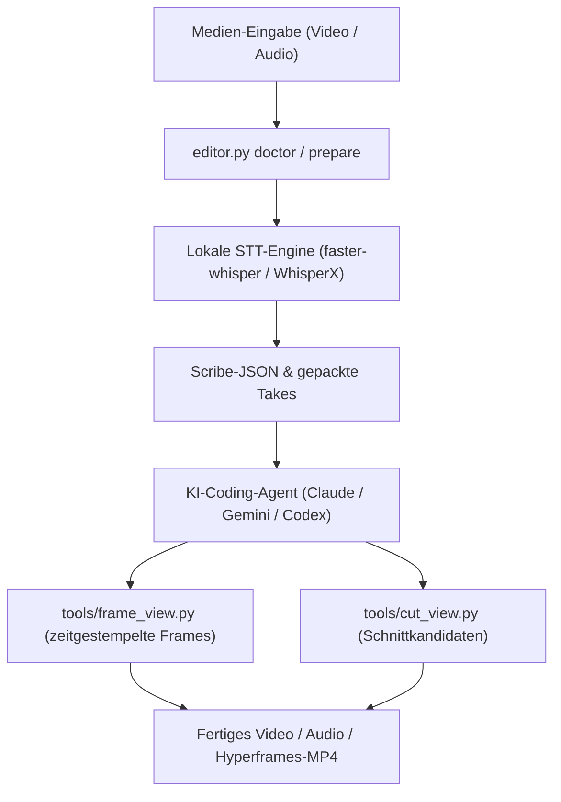

<p align="center"></p>

<p align="center">
  <a href="https://github.com/ellmos-ai/ai-media-editor"></a>
  <a href="https://github.com/ellmos-ai/ai-media-editor/blob/main/LICENSE"></a>
  <a href="https://python.org"></a>
  <a href="https://github.com/ellmos-ai/ai-media-editor#discovery-context"></a>
</p>

<p align="center"><a href="README.md">English</a> · <strong>Deutsch</strong></p>

# ai-media-editor — lokaler KI-Medien-Editor (Video · Audio · Podcast)

> [!NOTE]
> **KI-/Agenten-native Integration:** `ai-media-editor` ist gezielt für die autonome Ausführung durch Agenten gebaut (Claude Code, Gemini/Antigravity, Codex). Es liefert deterministische Projektvorbereitung, Erzeugung von Scribe-JSON nach Schema und zeitgestempelte Frame-Kontaktbögen, damit LLMs Medien lokal visuell beurteilen und schneiden können — ohne Abhängigkeit von fremden SaaS-Diensten.

Einen KI-Coding-Agenten (z. B. Claude Code) als Video-/Podcast-Editor einsetzen — mit **lokaler
Transkription statt ElevenLabs Scribe**. Der Orchestrator (`editor.py`) übernimmt die
deterministische Vorbereitung (Routing zur passenden STT-Engine/Compute, Scribe-JSON erzeugen,
Takes packen); die kreative Schnitt- und Animationsarbeit fährt anschließend der Agent.

## Systemarchitektur



## Hier starten

| Ziel | Datei / Befehl |
|---|---|
| Workflow verstehen | [`CLAUDE.md`](CLAUDE.md) und [`docs/USECASES.md`](docs/USECASES.md) |
| Lokale Werkzeuge konfigurieren | [`config/settings.example.json`](config/settings.example.json) nach `config/settings.json` kopieren |
| Umgebung prüfen | `PYTHONIOENCODING=utf-8 <VENV> editor.py doctor` |
| Medienprojekt vorbereiten | `PYTHONIOENCODING=utf-8 <VENV> editor.py prepare "<media>" --mode <1-8>` |
| Frame-Kontext für Video aufbauen | `PYTHONIOENCODING=utf-8 <VENV> editor.py frames <project> --contact-sheet` |
| LLM-Crawlern die Kurzkarte geben | [`llms.txt`](llms.txt) |

## Was es ist

Ein Stack aus drei Werkzeugen:
- **video-use** — schneidet anhand des wortgenauen Transkripts (entfernt Pausen/Versprecher)
- **Hyperframes** — HTML/CSS/JS → MP4-Animationen
- **`frontend-design`-Skill** — erzeugt Motion Graphics / Branding

…wobei die **ElevenLabs-Scribe-Transkription durch lokale Engines ersetzt** ist. Standard ist
**faster-whisper** plus textbasierte LLM-Sprecherzuordnung für Gespräche; **WhisperX** ist die
optionale Engine für akustische Diarisierung. Compute läuft standardmäßig lokal, optional mit
**Remote-Host-primär, lokalem Fallback**. Der Ersatz schreibt genau die Scribe-Felder, die
`video-use` verwendet — die nachgelagerten Helfer laufen dadurch ungepatcht weiter.

## Einrichtung

1. **Konfiguration anlegen:** `config/settings.example.json` → `config/settings.json` kopieren und
   die eigenen Werte eintragen (Compute `local`/`mac`, Engines, `paths.*`).
2. **`<TOOLS_ROOT>`** in dieser Dokumentation = `paths.tools_root` aus der eigenen
   `settings.json` — der Ort der schweren Werkzeuge samt venv (`video-use`, ffmpeg, Node ≥ 22).
   **Nicht** in einen synchronisierten Cloud-Ordner legen (venv-/Sync-Konflikte).
   `<OPENMONTAGE_DIR>` = optionaler OpenMontage-Klon (nur für den Werbeclip-Usecase 8).
3. Externe Werkzeuge: `video-use` (transkriptbasierter Schnitt auf Basis von browser-use),
   Hyperframes (HTML→MP4) und der `frontend-design`-Skill. STT läuft lokal über
   faster-whisper/WhisperX.

## Schnellstart

```bash
VENV="<TOOLS_ROOT>/.venv/Scripts/python.exe"

# Environment check
PYTHONIOENCODING=utf-8 "$VENV" editor.py doctor

# Usecase table
PYTHONIOENCODING=utf-8 "$VENV" editor.py modes

# Prepare a project (transcribe + pack)
PYTHONIOENCODING=utf-8 "$VENV" editor.py prepare "/path/to/recording.mp4" --mode 3 --project my-video

# Video only (UC3/4/8): timestamped frames so the agent can judge the picture over time
PYTHONIOENCODING=utf-8 "$VENV" editor.py frames my-video --contact-sheet          # coarse overview
PYTHONIOENCODING=utf-8 "$VENV" editor.py frames my-video --from 30 --to 45 --step 0.25  # zoom in
```

Danach fährt der Agent den kreativen Schnitt-/Animationsteil — siehe [`CLAUDE.md`](CLAUDE.md)
(deutsch, an den Agenten gerichtet) und [`docs/USECASES.md`](docs/USECASES.md).

## Die 8 Usecases

| # | Eingabe | Sprecher | Ausgabe |
|---|---|---|---|
| 1 | Audio | 1 | Audio-Podcast, geschnitten |
| 2 | Audio | mehrere | Audio-Podcast, Sprecher-getrennt |
| 3 | Video (A+V) | 1 | Video geschnitten + Animationen |
| 4 | Video (A+V) | mehrere | Video + Animationen + Sprecher-Tracking |
| 5 | Video → nur Ton | 1/mehrere | Audio-Podcast (Bild verworfen) |
| 6 | Audio | 1/mehrere | Voll generiertes Erklärvideo |
| 7 | Audio | 1 | Audio + animiertes Cover |
| 8 | Audio/Briefing | 1 | Werbeclip (15–60 s, 16:9 + 9:16) — OpenMontage-`clip-factory` / Hyperframes |

## Discovery-Kontext

Für die Suche nach diesem Repository die kanonische Bezeichnung
**`ellmos-ai/ai-media-editor`** verwenden. Hilfreiche Suchbegriffe:

```text
local AI media editor video podcast transcription
agent driven video editor with local transcription
Claude Code video podcast editor Hyperframes
faster-whisper WhisperX Scribe JSON video-use
transcript based video cutting local first
Hyperframes motion graphics podcast editor
```

Dieses Projekt ist **kein** gehosteter SaaS-Editor, kein Stock-Media-Marktplatz, keine generische
ffmpeg-Oberfläche und kein Wrapper um ElevenLabs Scribe. Es ist ein Local-First-Orchestrierungs-Repo,
das Transkript-, Frame- und Schnittkontext so aufbereitet, dass ein KI-Coding-Agent den kreativen
Schnitt fahren kann.

## Struktur

```
ai-media-editor/                  (Code/Doku/Projekte)
├── CLAUDE.md                     ← Agenten-Leitfaden (Editor-Workflow, deutsch)
├── README.md
├── editor.py                     ← Orchestrator (prepare / frames / modes / doctor)
├── tools/
│   ├── cut_view.py               ← Pausen als explizite Schnittkandidaten
│   ├── frame_view.py             ← Video → zeitgestempelte Frames („Video-Scatterer", UC3/4/8)
│   ├── compose_cover.py          ← UC7: Cover als Loop über die Tonspur legen
│   └── compose_music.py          ← Storyline-JSON → videosynchroner Score (numpy-Waveform-Synthese)
├── stt/
│   ├── scribe_schema.py          ← Scribe-JSON-Format (Kontrakt mit video-use)
│   ├── transcribe_local.py       ← faster-whisper + WhisperX → Scribe-JSON
│   └── mac_remote.py             ← Compute-Routing (Remote primär, lokaler Fallback)
├── config/settings.example.json  ← Vorlage: Compute, Engines, Modelle, Pfade, HF-Token
├── brand/design-tokens.css       ← Branding-Tokens für generierte Animationen
├── docs/USECASES.md              ← Schritt für Schritt je Modus
├── production/                   ← optionale generative Workflows (Cloud-Gates gelten)
├── tests/test_core.py            ← abhängigkeitsfreie Regressions-Suite
├── SECURITY.md                   ← vertrauliche Schwachstellenmeldung und Sicherheitsrahmen
└── projects/<name>/edit/         ← je Projekt: transcripts/, takes_packed.md, … (gitignored)

<TOOLS_ROOT>/                     (KEIN Cloud-Ordner — venv/Werkzeuge)
├── .venv/                        ← Python-venv (faster-whisper, video-use, …)
└── video-use/                    ← geklontes browser-use/video-use (ungepatcht)
```

> `config/settings.json` und die Inhalte von `projects/` sind nutzerspezifisch und
> **gitignored** — zum Start `settings.example.json` kopieren.

## Voraussetzungen

- **Lokal:** ffmpeg, Node ≥ 22 (Hyperframes), ein Python-venv unter `<TOOLS_ROOT>`.
- **Optionaler Remote-Host** (z. B. eine leistungsfähigere Maschine): faster-whisper + WhisperX in
  einem venv, per SSH erreichbar (unter `mac` in der `settings.json` konfigurieren).
- **HuggingFace-Token** nur, wenn `engines.multi_speaker` auf `whisperx` steht; der
  Standardweg faster-whisper + LLM braucht keins.

## Generative Produktion (optional)

Der Ordner [`production/`](production/OVERVIEW.md) deckt Workflows ab, die neue Musik, Sprache,
Videos, Texte, Erzählungen oder PR-Material erzeugen. Diese Workflows sind vom Editor-Kern getrennt
und können fremde Cloud-Dienste nutzen. Vor jedem Upload sicherstellen, dass die nötigen Rechte,
Einwilligungen und Vertraulichkeitsfreigaben vorliegen und die Aufbewahrungspraxis des Anbieters
akzeptabel ist. Niemals standardmäßig Geheimnisse oder Kundenmaterial hochladen.

### Videosynchroner Score (music-composer)

`tools/compose_music.py` komponiert einen Hintergrund-Score, der der Storyline eines Videos folgt —
vollständig lokal, ohne Cloud-Dienst. Eingabe ist ein **Storyline-JSON**: Abschnitte mit exakten
Zeitfenstern plus Emotion/Intensität sowie optionale Timeline-Ereignisse (`damp` = gaußsches
Absenken auf einen dramatischen Beat, `climax`-Fenster, `outro`). Die Intensität steuert Tempogefühl,
Anzahl der Ebenen und Lautstärkeverlauf; die Emotion steuert Akkordfolgen und Wellenformen.
Stile: `chiptune`, `ambient`, `electronic`. Deterministisch über `seed`. Abhängigkeiten: numpy
(+ ffmpeg für MP3).

```bash
python tools/compose_music.py docs/examples/storyline-roshambo.json -o projects/<name>/assets/score
python tools/compose_music.py --init       # storyline template
python tools/compose_music.py --selftest   # 3 s render + verification
```

Ausgabe: Stereo-WAV + MP3 + `<name>.notes.json` (Arrangement-/Notenprotokoll — was wann spielt)
+ `<name>.mid` (Standard MIDI File, Typ 1, Tempo-Map + GM-Programmhinweise).
Grenzen: Die Waveform-Synthese deckt Hintergrundteppiche in chiptune/ambient/electronic ab — nicht
Pop/Rock/Klassik oder orchestrale Filmmusik (keine Samples, keine realistischen Instrumente).
Siehe [`production/musik/WORKFLOW.md`](production/musik/WORKFLOW.md) für cloudbasierte Alternativen
(Suno/Udio), wenn realistische Instrumentierung nötig ist.

**Bessere Klänge über den MIDI-Export.** Die Genre-Obergrenze liegt am *Sound-Backend*, nicht an der
Komposition — das Arrangement ist backend-neutral. `<name>.mid` rendern über:

- **Weg A — SoundFont (empfohlen, lokal, kostenlos):** FluidSynth installieren
  (fluidsynth.org oder `winget install FluidSynth`) plus eine freie GM-SF2
  (z. B. GeneralUser GS von S. Christian Collins oder MuseScore_General.sf2), dann
  `fluidsynth -ni soundfont.sf2 out.mid -F out.wav -r 44100` und mit ffmpeg encodieren.
  Deckt Pop-/Rock-Bandklänge, Klavier und einfache Streicher ab.
- **Weg B — orchestral/Film:** freie Orchesterbibliotheken (VSCO 2 Community Edition,
  Soni Musicae, Salamander Grand Piano) für bessere Streicher/Blechbläser. Ehrlicherweise:
  Artikulation und Humanisierung (Velocity-Variation, Legato, Dynamikkurven) zählen mehr
  als der Sample-Satz; echte Filmmusik-Wucht braucht zusätzlich ein reifes Arrangement —
  ein Backend allein genügt nicht.
- **Weg C — externe KI-Generierung (Suno usw.):** möglich, aber zuerst Datenschutz und Rechte
  prüfen und nur nach ausdrücklicher Freigabe durch den Nutzer — nie der Standardweg.

Eine `humanize`-Option (Velocity-/Timing-Jitter je Note, damit Samples nicht mechanisch klingen)
ist als TODO im Docstring der Engine vermerkt, aber noch nicht umgesetzt.

## Datenschutz, Rechte und Betriebsgrenzen

- Der lokale Modus hält die Transkription auf der aktuellen Maschine. Der Remote-Modus lädt das
  vollständige Eingabematerial auf den vom Nutzer konfigurierten SSH-Host, arbeitet in einem
  isolierten Job-Verzeichnis und räumt es nach dem Lauf nach bestem Bemühen wieder ab.
- Für Rechte an Quellmaterial, Stimmen, Musik, erzeugten Assets, Modellausgaben und kommerzieller
  Nutzung ist der Nutzer verantwortlich. Stimmklonen erfordert die ausdrückliche Erlaubnis der
  aufgenommenen Person.
- Dieses Projekt steht in keiner Verbindung zu ElevenLabs, HeyGen, browser-use oder einem der in
  den optionalen Workflows genannten Cloud-Anbieter. Funktionen, Bedingungen, Preise und
  Modelllizenzen der Anbieter können sich ändern.
- Das erzeugte Transkript ist eine konsumentenkompatible Teilmenge für die mitgelieferten
  `video-use`-Helfer, keine bytegenaue Nachbildung jedes ElevenLabs-Antwortfeldes.

## Qualitätsprüfungen

Die schnellen Prüfungen des Repositories laden keine STT-Modelle und brauchen keine Mediendateien:

```bash
python -m unittest discover -s tests -v
ruff check .
python editor.py modes
```

Echte Transkription, ffmpeg-Rendering, SSH und Anbieter-Workflows bleiben umgebungsabhängig;
vor deren Nutzung `python editor.py doctor` ausführen.

## Entwicklungsstand

Version 0.2.0 ist ein **Härtungsstand in Entwicklung**, kein stabiles Release — es gibt noch keinen
Tag. Die deterministische Pipeline ist durch Regressionstests abgedeckt, aber echte Läufe mit
ffmpeg, STT, SSH und Anbietern sind umgebungsabhängig und wurden vom schnellen Gate nicht
ausgeführt. Was verifiziert ist, was ausdrücklich *nicht* behauptet wird und was vor einem stabilen
Tag offen bleibt, steht in [`RELEASE_GATE.md`](RELEASE_GATE.md); die offenen Arbeitspunkte stehen in
[`TODO.md`](TODO.md).

## Credits / Lizenzen

- video-use: [browser-use/video-use](https://github.com/browser-use/video-use) (MIT)
- Hyperframes: [heygen-com/hyperframes](https://github.com/heygen-com/hyperframes) (Apache-2.0)
- STT: faster-whisper (MIT), WhisperX (BSD-2)
- Dieses Projekt: **MIT** — siehe [LICENSE](LICENSE).
